# Architecture Overview

The DayZ script system is organized as a **layered architecture** with five numbered layers, each building on the one below. The scripts are written in **Enforce Script** (`.c` files), Bohemia Interactive's proprietary scripting language that runs on the Enfusion engine.

## The Five-Layer System

```mermaid
flowchart LR
    subgraph Layer5["Layer 5: Mission (5_mission/)"]
        L5["Mission lifecycle, UI screens, HUD"]
    end
    subgraph Layer4["Layer 4: World (4_world/)"]
        L4["World entities, gameplay classes, systems, plugins"]
    end
    subgraph Layer3["Layer 3: Game (3_game/)"]
        L3["DayZGame, DayZPlayer, AI, damage, effects, weather"]
    end
    subgraph Layer2["Layer 2: Game Library (2_gamelib/)"]
        L2["Game base class, input, menus, settings, utilities"]
    end
    subgraph Layer1["Layer 1: Core (1_core/)"]
        L1["Constants, defines, Param system, native proto bindings"]
    end

    L4 -->|"Depends on: 3_game, 2_gamelib, 1_core"| L3
    L3 -->|"Depends on: 2_gamelib, 1_core"| L2
    L2 -->|"Depends on: 1_core"| L1
    L5 -->|"Depends on: everything below"| L4
```



### Layer Summary

| Layer | Directory | Purpose |
|-------|-----------|---------|
| **Layer 1** | `1_core/` | Language-level primitives — constants, preprocessor defines, the `Param` serialization system, Workbench editor API, and all native engine function prototypes (proto bindings) |
| **Layer 2** | `2_gamelib/` | Game-agnostic framework — `Game` base class, input action manager, menu/dialog system, deferred call queue, declarative settings framework, and a unit test framework |
| **Layer 3** | `3_game/` | DayZ-specific game logic — `DayZGame`, `DayZPlayer`, the entity hierarchy (`Human`, `DayZCreature`, `Transport`), damage system, effect/particle system, weather, AI, vehicle simulation, and networking |
| **Layer 4** | `4_world/` | World simulation — all gameplay classes (weapons, inventory, crafting, cooking, player stats, stamina, emotes), organized as class files in `classes/`, update-driven systems, and a plugin architecture |
| **Layer 5** | `5_mission/` | Top of the stack — mission factory entry point (`CreateMission`), mission lifecycle classes, and the entire user interface (HUD, menus, script console, settings screens) |

## Data vs. Logic

A key architectural principle is the **separation of data from logic**:

| Aspect | Scripts (`scripts/`) | Config (`DZ/`) |
|--------|---------------------|-----------------|
| **What it is** | Runtime Enforce Script code | Static config.cpp definitions |
| **Purpose** | Behavior, simulation, control flow | Object properties, structure, metadata |
| **Examples** | How damage is calculated, how inventory works | Item weight, size, model path, attachment slots |
| **Language** | Enforce Script (`.c`) | Config classes (`.cpp`) |

The scripts implement **how things work**, while the config defines **what things are**.

## Entity Hierarchy

All objects in the DayZ world inherit from a shared class hierarchy rooted in the engine:

```
IEntity (engine-level)
  └── Object
       └── ObjectTyped
            ├── Entity (animation, simulation)
            │    └── EntityAI (damage zones, inventory)
            │         ├── DayZCreature
            │         │    └── DayZCreatureAI
            │         │         ├── DayZAnimal
            │         │         └── DayZInfected (zombies)
            │         ├── Pawn (animated characters)
            │         │    ├── Person → Man → Human → DayZPlayer
            │         │    └── Transport → Car / Boat / Helicopter
            │         ├── Building
            │         ├── InventoryItem
            │         └── ScriptedEntity
            └── Camera
```

See the [Entity Hierarchy page](./entity-hierarchy) for a detailed breakdown.

## Key Architectural Principles

1. **Layered dependencies**: Code in a higher layer can reference anything in lower layers. Layer 5 can use Layer 1 primitives; Layer 1 cannot reference Layer 5.
2. **Singleton game instance**: `g_Game` / `GetGame()` (defined in `2_gamelib`) provides global access to the `DayZGame` instance throughout all layers.
3. **Component-based entities**: Entities aggregate behaviors via components and an FSM-driven inventory system.
4. **Event-driven communication**: The `ScriptInvoker` pattern and RPC system enable decoupled communication between systems.
5. **Config-driven objects**: Nearly every gameplay object is defined in `config.cpp` and instantiated at runtime — scripts rarely hardcode object properties.
