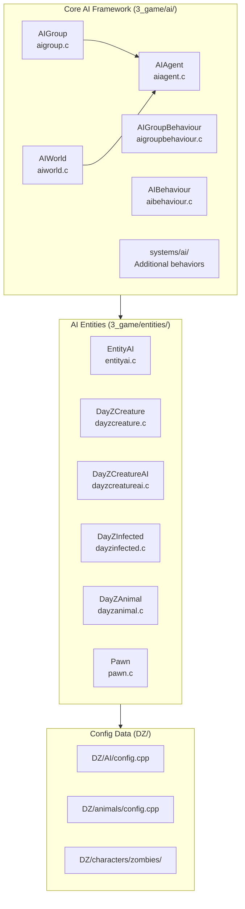
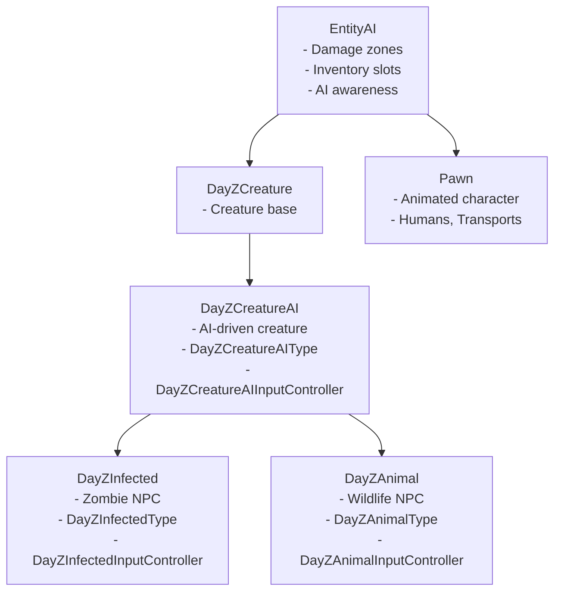
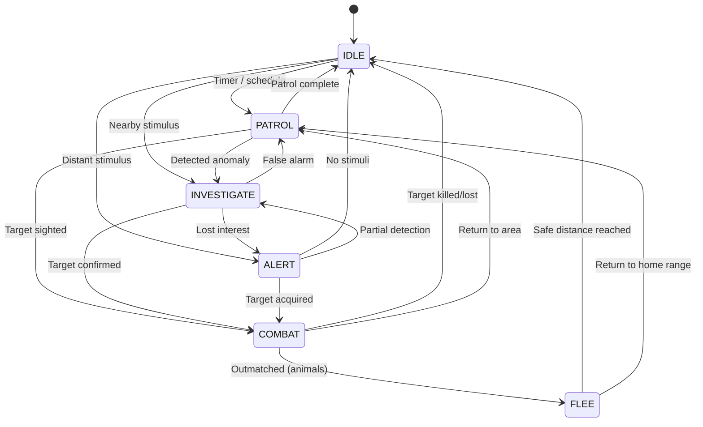
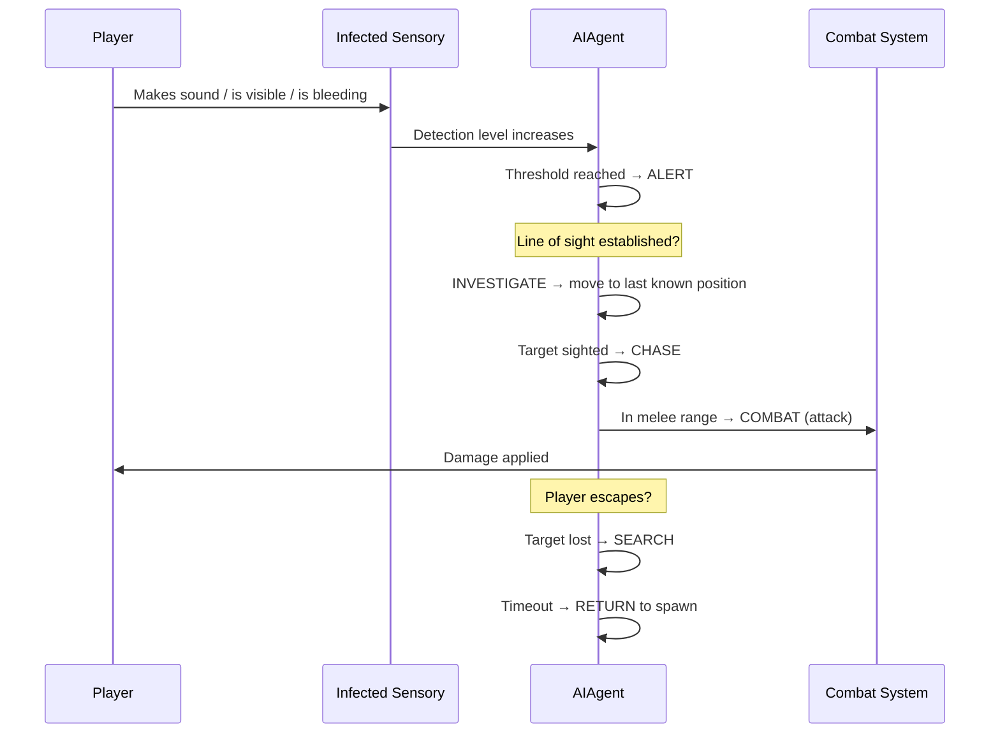

# AI System

The AI system controls non-player entities including zombies (infected) and wildlife (animals). It manages agent behavior, group coordination, sensory processing, and world-level AI population management.

## Architecture



## Entity Hierarchy



## AI Agent

Individual AI entities are managed by `AIAgent`:

```c
class AIAgent {
    // Current behavior state
    AIBehaviorState m_State;
    // Target information
    EntityAI m_Target;
    vector m_TargetPosition;
    // Awareness
    float m_Awareness;        // 0.0 — 1.0 detection level
    float m_ThreatLevel;      // Perceived threat (0.0 — 1.0)
};
```

### Behavior States

```c
enum AIBehaviorState {
    IDLE,           // Standing around, no target, random animations
    PATROL,         // Following patrol path or wandering
    INVESTIGATE,    // Investigating a stimulus (sound, visual anomaly)
    COMBAT,         // Engaged with target (chase / attack)
    FLEE,           // Running from threat (animals)
    ALERT,          // Alert but no direct target (searching)
};
```



### Awareness System

Awareness is a continuous value (0.0–1.0) that represents how aware an AI is of a potential threat:

```c
class AIAgent {
    // Awareness modifiers
    float m_DetectionSpeed;       // How fast awareness increases
    float m_DetectionDropoff;     // How fast awareness decays
    
    float m_SightRange;           // Max sight distance
    float m_HearingRange;         // Max hearing distance  
    float m_SmellRange;           // Max smell distance (infected only)
};
```

- **Increases**: When stimuli are sustained (continuous sound, line of sight)
- **Decreases**: When stimuli stop (target out of sight, sound ends)
- **Thresholds**: Low awareness = alert; Medium = investigate; High = combat

### Pathfinding

AI entities navigate the world through the engine's pathfinding system, which integrates with:

- **NavMesh**: Engine-level navigation mesh defines walkable areas
- **Dynamic obstacles**: Doors, vehicles, and construction can affect pathfinding
- **AI World queries**: `AIWorld.FindNearestAgent()` and `IsPositionSafe()` for spatial awareness
- **Patrol paths**: Config-defined waypoints for patrol behavior

## AI Group

Groups coordinate multiple AI agents for tactical behavior:

```c
class AIGroup {
    // Group members
    ref array<AIAgent> m_Members;
    // Group behavior
    AIGroupBehaviour m_Behaviour;
    // Group tactics
    int m_FormationType;
    vector m_GroupCenter;
};
```

### Group Behaviors

```c
class AIGroupBehaviour {
    void OnCombat(AIAgent caller, EntityAI target);
    void OnMemberKilled(AIAgent victim);
    void OnInvestigate(AIAgent caller, vector position);
    void OnAlert(AIAgent caller);
    
    // Tactical coordination
    void FlankTarget();        // Surround from sides
    void SurroundTarget();     // Full encirclement
    void Retreat();            // Group withdrawal
};
```

Group behaviors enable coordinated actions:
- **Infected hordes**: Surround and close in on the player from multiple angles
- **Animal packs**: Wolves circle and attack from different directions
- **Flanking**: Members spread out to approach from different vectors

## Infected (Zombies)

`DayZInfected` manages zombie NPC behavior — the most common AI entity in DayZ.

### Sensory System

```c
class DayZInfectedInputController {
    // Detection ranges (config-defined per infected type)
    float m_SightRange;           // Visual detection distance
    float m_HearingRange;         // Audio detection distance
    float m_SmellRange;           // Olfactory detection (blood, fresh corpses)
    
    // Detection modifiers
    float m_DetectionSpeed;       // How fast detection accumulates
    float m_DetectionDropoff;     // How fast it decays
    
    // Current state
    float m_DetectionLevel;       // 0.0 — 1.0
    EntityAI m_SuspectedTarget;
};
```

### Infected Behavior States

| State | Behavior |
|-------|----------|
| **Idle** | Standing still, random animations (looking around, scratching), ambient sounds |
| **Wander** | Random movement within spawn area, no active target |
| **Alert** | Head turns toward stimulus, detection begins accumulating |
| **Investigate** | Move toward last known stimulus position |
| **Chase** | Pursuing detected target at full speed |
| **Combat** | In melee range, attacking the target |
| **Search** | Looking for lost target at last known position |
| **Return** | Going back to spawn area after losing target |

### Types (`DayZInfectedType`)

Different infected types have config-defined properties:

| Type | Speed | Toughness | Detection | Damage |
|------|-------|-----------|-----------|--------|
| **Walker** | Slow walk | Medium | Low sight, high hearing | Low |
| **Runner** | Fast sprint | Low | High sight, medium hearing | Medium |
| **Military** | Jog | High (armor) | All ranges high | High |
| **Bloated** | Slow | Very high | Low (smell focused) | Very high |
| **Child** | Run | Low | Medium sight, low hearing | Low |

Properties are defined in `DZ/AI/config.cpp` and `DZ/characters/zombies/`.

## Animals

`DayZAnimal` manages wildlife behavior:

```c
class DayZAnimalInputController {
    // Movement
    void SetWanderTarget();
    void SetFleeTarget(vector awayFrom);
    
    // State
    EAnimalState m_AnimalState;
};

enum EAnimalState {
    IDLE,       // Resting, grazing
    WANDER,     // Random movement within home range
    FLEE,       // Running from threat (primary response)
    ATTACK,     // Rare aggression (bears, wolves)
    EATING,     // Consuming food
    DRINKING    // At water source
};
```

### Animal Behaviors

| Behavior | Description |
|----------|-------------|
| **Flee** | Primary threat response — runs away from danger, speed varies by animal |
| **Wander** | Random movement within a config-defined home range center |
| **Grazing** | Eating/drinking animations at suitable locations |
| **Attack** | Rare — bears defend cubs/territory, wolves hunt in packs |
| **Flock/herd** | Group coordination for social animals (deer, cattle) |
| **Circadian** | Activity patterns based on time of day (nocturnal vs diurnal) |

### Animal Types

| Animal | Behavior | Threat Response |
|--------|----------|-----------------|
| **Deer** | Graze/wander in herds, seasonal migration | Flee at long distance |
| **Rabbit** | Small home range, fast | Flee at close distance |
| **Cow/Pig** | Domestic, slow movement | Minimal flee response |
| **Wolf** | Pack hunter, territorial | Investigate → Surround → Attack |
| **Bear** | Solitary, large territory | Avoid → Warn → Charge |
| **Chicken** | Small birds, flock | Flee immediately |

## AI World Management

```c
class AIWorld {
    // World-level AI management
    void RegisterAgent(AIAgent agent);
    void UnregisterAgent(AIAgent agent);
    
    // World queries
    AIAgent FindNearestAgent(vector position, float radius);
    bool IsPositionSafe(vector position);
    float GetAmbientThreat(vector position);
};
```

Responsibilities:
- Agent lifecycle (spawn/despawn management)
- Population density control per area
- Ambient threat level queries for game logic
- Cleanup of destroyed/distant agents

## AI Config Data

AI entity properties are defined in config files:

```cpp
// DZ/AI/config.cpp (infected behavior defaults)
class CfgAI {
    class Infected_Base {
        sightRange = 100.0;
        hearingRange = 150.0;
        smellRange = 50.0;
        detectionSpeed = 0.1;
        detectionDropoff = 0.05;
        moveSpeedWalk = 2.0;
        moveSpeedRun = 6.0;
        health = 200;
    };
    
    class Infected_Runner : Infected_Base {
        sightRange = 150.0;
        moveSpeedRun = 9.0;
        health = 100;
    };
};
```

Config properties include:
- Detection ranges (sight, hearing, smell) per type
- Movement speeds (walk, run, sprint) per state
- Health and damage values
- Behavior parameters (aggression, fear, curiosity, persistence)
- Spawn rules (time of day, weather, population caps)
- Home range size and return behavior

## Combat Flow (Infected)



## Integration with Other Systems

- **Entity hierarchy**: AI entities share the `Pawn` base with players — see [Entity Hierarchy](/architecture/entity-hierarchy)
- **Damage system**: AI entities take damage, bleed, and die — see [Damage & Combat](./damage-combat)
- **Sound system**: AI hearing detection uses sound events generated by players/actions — see [Sound System](./sound-system)
- **Animation system**: AI behavior state drives animation selection — see [Animation System](./animation-system)
- **Effects system**: Death effects, blood particles on hit — see [Effect System](./effect-system)
- **Weather system**: Weather affects AI detection ranges (fog reduces sight, rain masks sound) — see [Weather & Environment](./weather-environment)
- **Network**: AI state synchronization in multiplayer (position, health, behavior state) — see [Networking & RPC](./networking)
- **Data Config**: AI type definitions — see [Data Config: Characters](/data-config/characters)
