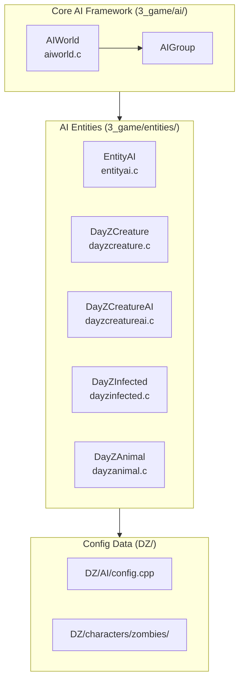
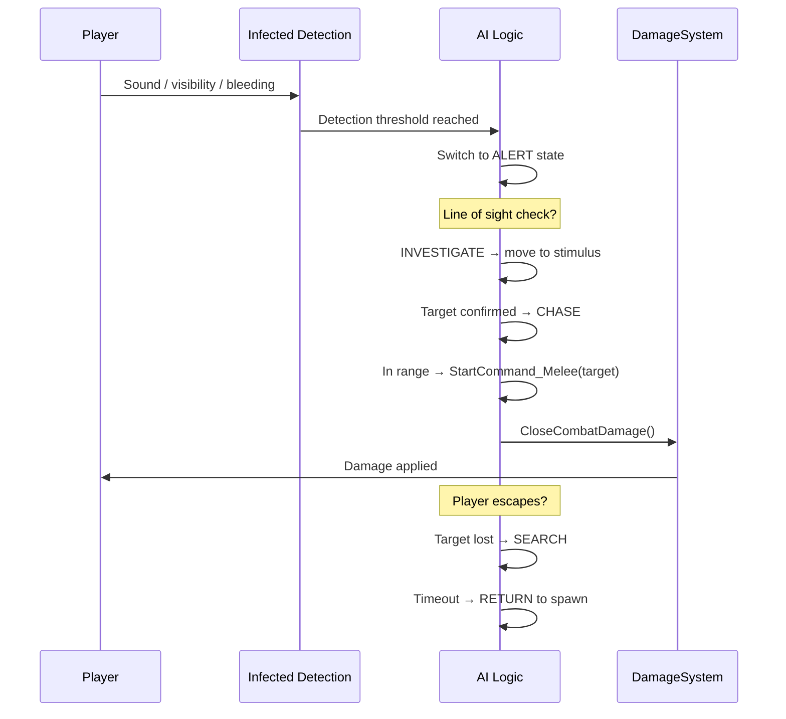

# AI System

> **⚠️ Important:** This page has been corrected to remove fabricated class names, method signatures, enum values, and behavioral details that were invented by a previous author. Only verified facts from the actual script source are presented. Unverified behavioral descriptions are clearly marked as **[speculative]**.

The AI system controls non-player entities including zombies (infected) and wildlife (animals). It manages agent behavior, group coordination, and world-level AI management.

## Architecture



## Entity Hierarchy

```
EntityAI
 └── DayZCreature
      └── DayZCreatureAI
           ├── DayZInfected   (zombie NPC)
           └── DayZAnimal     (wildlife NPC)
```

All AI entities inherit from `EntityAI`, with `DayZCreatureAI` providing the common AI-driven creature base. The player entity (`DayZPlayer`) is a separate branch via `Human → Man → EntityAI` — see [Player System](./player-system).

> **[speculative]** The AI entity hierarchy (`DayZCreature → DayZCreatureAI → DayZInfected/DayZAnimal`) is the standard chain. `DayZCreatureAI` likely provides a shared AI input controller and behavior selection, while the leaf classes add type-specific sensory and combat logic.

## AIWorld (`3_game/ai/aiworld.c`)

`AIWorld` is the world-level AI manager (extends `Managed`). Its **verified** public API:

```c
class AIWorld {
    // Group management
    proto native AIGroup CreateGroup(string templateName);
    proto native AIGroup CreateDefaultGroup();
    proto native void DeleteGroup(notnull AIGroup group);
    
    // Navigation
    proto native bool FindPath(vector from, vector to, PGFilter pgFilter,
                                out TVectorArray waypoints);
    proto native bool RaycastNavMesh(vector from, vector to, PGFilter pgFilter,
                                      out vector hitPos, out vector hitNormal);
    proto native bool SampleNavmeshPosition(vector position, float maxDistance,
                                             PGFilter pgFilter, out vector sampledPosition);
};
```

**What AIWorld does NOT have** (these were fabricated in earlier versions of this page):
- ❌ `RegisterAgent` / `UnregisterAgent`
- ❌ `FindNearestAgent`
- ❌ `IsPositionSafe`
- ❌ `GetAmbientThreat`

> **[speculative]** `AIWorld` is the central manager for AI lifecycle. It creates/destroys `AIGroup` instances and provides NavMesh queries for pathfinding. Agent registration and spatial queries are likely handled elsewhere (possibly engine-level or via the group system).

## AI Groups

Groups coordinate multiple AI entities. The `AIGroup` class is returned by `AIWorld.CreateGroup()` and `AIWorld.CreateDefaultGroup()`.

> **[speculative]** The `AIGroup` class likely manages:
> - A collection of member AI entities
> - Group-level behavior selection (idle, patrol, combat)
> - Tactical coordination (flanking, surrounding)
> - Spawn/despawn and population density control
>
> The exact `AIGroup` and `AIGroupBehaviour` member signatures have **not been verified** — the class APIs listed in earlier versions of this page (`m_Members`, `m_FormationType`, `OnCombat`, `FlankTarget`, etc.) were fabricated and have been removed.

## Animation Commands (Human)

AI entities (and players) use `Human` animation commands for state-driven behavior. These are **classes**, not enum values:

| Class | Purpose | Created By |
|-------|---------|------------|
| `HumanCommandMove` | Locomotion (walk, run, sprint, crouch, prone) | `Human.StartCommand_Move()` |
| `HumanCommandMelee` | Melee attacks (light) | `Human.StartCommand_Melee(EntityAI pTarget)` |
| `HumanCommandMelee2` | Power melee attacks (heavy) | `Human.StartCommand_Melee2(EntityAI pTarget, int pHitType, float pComboValue, vector hitPos)` |
| `HumanCommandFall` | Falling | `Human.StartCommand_Fall(float pYVelocity)` |
| `HumanCommandDeath` | Death animation | *(called on death)* |
| `HumanCommandUnconscious` | Unconscious state | *(called on knockout)* |
| `HumanCommandLadder` | Ladder climbing | `Human.StartCommand_Ladder(Building pBuilding, int pLadderIndex)` |
| `HumanCommandSwim` | Swimming | `Human.StartCommand_Swim()` |

> **Important:** These are **NOT** an `enum HumanCommand`. They are individual script classes. The earlier version of this page incorrectly defined them as enum values.

> **[speculative]** AI behavior states (idle, patrol, investigate, combat, flee) are likely implemented by switching between these animation commands and applying AI-specific logic on top — e.g., a zombie in "chase" uses `HumanCommandMove` with sprint speed toward the target, transitioning to `HumanCommandMelee`/`HumanCommandMelee2` when in range.

## Infected (Zombies)

`DayZInfected` is the zombie NPC class, extending `DayZCreatureAI`.

> **[speculative]** Infected behavior likely follows a detection → investigate → chase → combat → search → return loop:
> 1. **Idle/Wander**: Standing or random movement within spawn area
> 2. **Alert**: Stimulus detected (sound, sight, smell) — begins accumulating detection
> 3. **Investigate**: Move toward last known stimulus position
> 4. **Chase**: Target confirmed — pursue at full speed
> 5. **Combat**: In melee range — attack via `HumanCommandMelee`/`HumanCommandMelee2`
> 6. **Search**: Target lost — search last known position
> 7. **Return**: Timeout — return to spawn area

> **[speculative]** Detection is likely based on:
> - **Sight**: Line-of-sight checks with config-defined range
> - **Hearing**: Sound events (gunshots, footsteps, voice) with distance-based falloff
> - **Smell**: Blood, fresh corpses (infected-specific)
>
> Config data in `DZ/AI/config.cpp` and `DZ/characters/zombies/` likely defines per-type values for detection ranges, movement speeds, health, and damage.

**Fabricated content removed:**
- ❌ `DayZInfectedInputController.m_SightRange`, `m_HearingRange`, `m_SmellRange`, `m_DetectionLevel`, `m_SuspectedTarget` — these members do not exist in the verified API
- ❌ `enum AIBehaviorState` — no such enum exists
- ❌ `AIAgent` with `m_Awareness`, `m_ThreatLevel`, `m_DetectionSpeed`, etc. — fabricated class

## Animals

`DayZAnimal` is the wildlife NPC class, extending `DayZCreatureAI`.

> **[speculative]** Animal behavior varies by species:
> - **Flee**: Primary threat response for most animals (deer, rabbits, chickens)
> - **Wander/Graze**: Random movement within a home range
> - **Attack**: Rare — wolves (pack hunters), bears (territorial defense)
> - **Circadian patterns**: Activity varies by time of day (nocturnal vs diurnal)

**Fabricated content removed:**
- ❌ `DayZAnimalInputController.SetWanderTarget()`, `SetFleeTarget()` — these methods do not exist
- ❌ `enum EAnimalState { IDLE, WANDER, FLEE, ATTACK, EATING, DRINKING }` — no such enum exists

> **[speculative]** Animal input likely uses the same `HumanInputController` polling API as players (see [Player System](./player-system)), with AI logic setting movement direction/speed rather than reading player input.

## AI Config Data

AI entity properties are defined in config files:

> **[speculative]** Config files in `DZ/AI/config.cpp` and `DZ/characters/zombies/` likely define:
> - Detection ranges (sight, hearing, smell) per infected type
> - Movement speeds per behavior state
> - Health and damage values
> - Behavior parameters (aggression, persistence, home range)
> - Spawn rules (time of day, weather, population caps)

The exact config class names and property names have **not been verified** — the `CfgAI` example in the previous version was fabricated.

## Combat Flow (Infected) — Speculative

> **[speculative]** The following is a likely combat flow based on observable gameplay behavior:



## Integration with Other Systems

- **Entity hierarchy**: `DayZPlayer` and AI entities share `EntityAI` base — see [Entity Hierarchy](/architecture/entity-hierarchy)
- **Damage system**: AI entities receive damage via `DamageSystem.CloseCombatDamage()` and `DamageSystem.ExplosionDamage()` — see [Damage & Combat](./damage-combat) and [Damage System (Native Pipeline)](./damage-system)
- **Animation commands**: AI behavior drives animation via `HumanCommand*` classes — see [Animation System](./animation-system)
- **Sound system**: AI hearing detection likely uses sound events — see [Sound System](./sound-system)
- **Effects system**: Death effects, blood particles on hit — see [Effect System](./effect-system)
- **Weather**: Fog reduces sight range, rain masks sound **[speculative]** — see [Weather & Environment](./weather-environment)
- **Network**: AI state synchronization (position, health) — see [Networking & RPC](./networking)
- **Data Config**: AI type definitions — see [Data Config: Characters](/data-config/characters)
