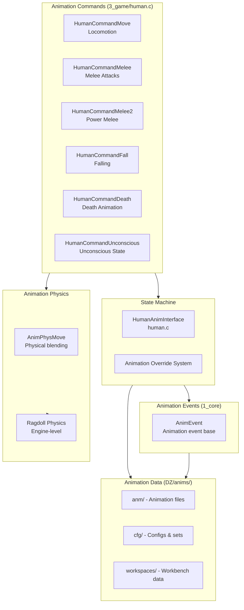
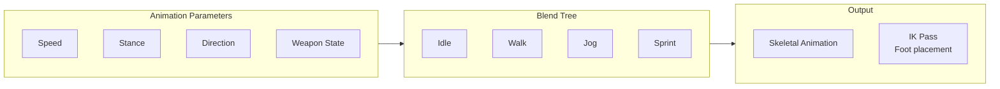
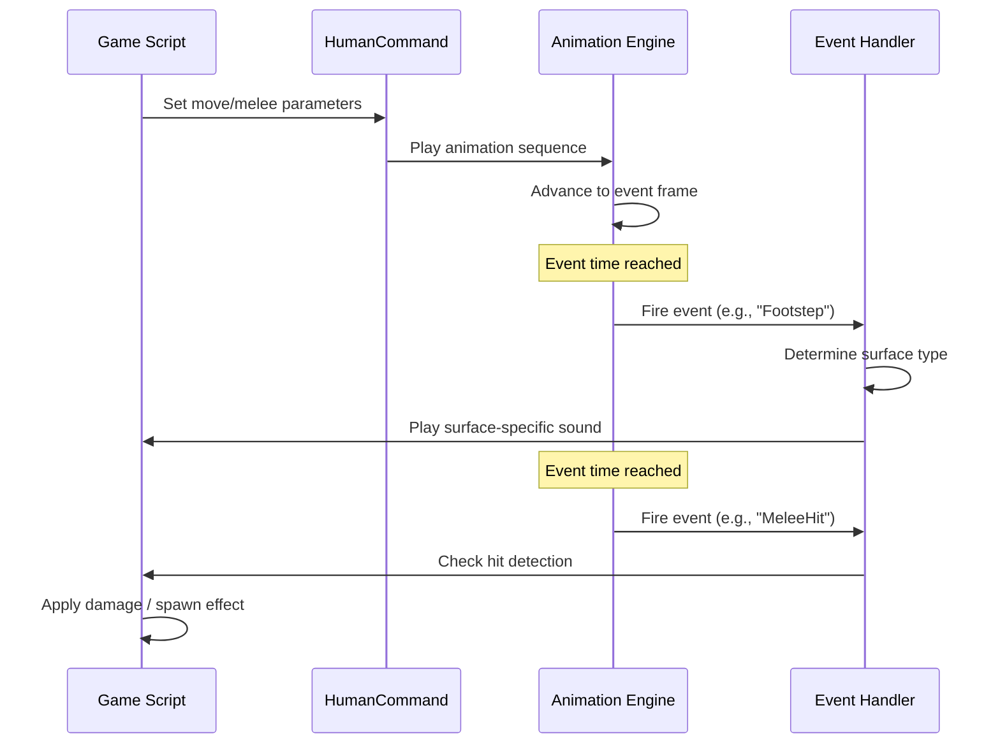
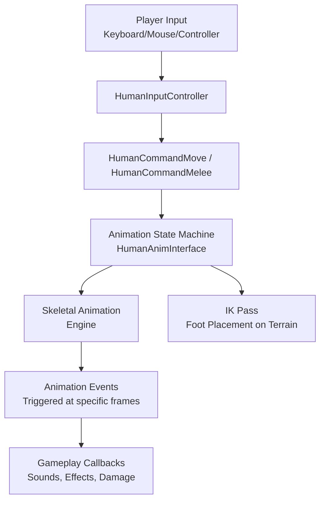

# Animation System

The animation system manages character animations, animation events, and the animation state machine. It bridges gameplay actions with visual character movement, handling everything from locomotion to complex combat animations.

## Architecture



## Animation Commands

Animation commands are the primary way scripts control character animation. Each command encapsulates a complete animation behavior:

```c
class HumanCommandMove {
    // Movement parameters
    float m_Speed;              // Movement speed (blends walk/jog/sprint)
    float m_Direction;          // Movement direction in degrees
    int m_Stance;               // Current stance (stand, crouch, prone)
    bool m_IsSprinting;         // Sprinting flag
    bool m_IsCrouching;         // Crouching flag
    
    // Movement types
    void SetMoveType(int type); // Walk, jog, sprint, crawl
    void SetStance(int stance); // Stand, crouch, prone
};

class HumanCommandMelee {
    // Melee parameters
    int m_AttackType;           // Light, heavy, combo
    int m_DamageType;           // Blunt, slash, stab
    bool m_IsHit;               // Whether attack connected
};
```

### Command Types

| Command | Purpose | Transition Conditions |
|---------|---------|----------------------|
| `HumanCommandMove` | Locomotion (walk, run, sprint, crouch, prone, swim, climb) | Stance change, speed threshold, surface type |
| `HumanCommandMelee` | Light melee attacks (fists, knives, light weapons) | Attack input, weapon type |
| `HumanCommandMelee2` | Heavy/power melee attacks (axes, bats, heavy weapons) | Heavy attack input, weapon type |
| `HumanCommandFall` | Falling from height | Vertical velocity threshold |
| `HumanCommandDeath` | Death animation sequence | Health reaches zero |
| `HumanCommandUnconscious` | Unconscious state | Shock/health threshold exceeded |

## HumanAnimInterface

The animation state machine that selects animations based on gameplay state:

```c
class HumanAnimInterface {
    // Command binding
    void BindCommand(HumanCommandBase command);
    
    // Variable binding — float, int, bool parameters
    void BindVariableFloat(string varName, float value);
    void BindVariableInt(string varName, int value);
    void BindVariableBool(string varName, bool value);
    
    // Tag and event binding
    void BindTag(string tagName, bool value);
    void BindEvent(string eventName);
};
```

The state machine blends between animations based on:
- **Current command**: Active `HumanCommand` determines animation category
- **Parameters**: Speed, stance, direction, weapon state
- **Overrides**: Script-forced animation sets (e.g., climbing, gestures)
- **Blend trees**: Smooth transitions between similar animations

### Animation Blending



Blend trees interpolate between animation poses based on parameter values, providing smooth transitions. The engine handles per-bone blending for upper/lower body separation (e.g., aiming while walking).

## Animation Events

Events are triggered at specific frames within animation sequences:

```c
// AnimEvent exists in 1_core/proto/animevent.c
class AnimEvent {
    int m_EventType;
    float m_Time;               // Time in animation when event fires (seconds)
    string m_Parameter;         // Event parameter (e.g., sound name, effect name)
};

// Common animation events:
// "Fire"      — Weapon fired (bullet spawn point)
// "Reload"    — Reload started/completed
// "Footstep"  — Foot planted (left/right)
// "MeleeHit"  — Melee attack impact frame
// "Land"      — Landing after jump/fall
// "Pickup"    — Item pickup animation frame
// "Eat"       — Food consumption frame
// "Drink"     — Liquid consumption frame
```

### Event Flow



### Animation Event Configuration

Animation events are defined in the animation config data, connecting frame-timed triggers to gameplay callbacks.

## Animation Command Flow



## Ragdoll & Physics

When death or unconsciousness occurs, the character transitions to ragdoll physics:

1. Animation state triggers `HumanCommandDeath` or `HumanCommandUnconscious`
2. Skeletal animation plays the initial death/fall animation
3. At a configurable transition point, the engine switches to physics-driven ragdoll
4. Ragdoll interacts with world geometry (slopes, obstacles)
5. After a timeout, ragdoll may blend back to a final resting pose

The `AnimPhysMove` (in `3_game/animphysmove.c`) handles the physical animation layer, including:
- Physical interaction with world objects
- Blending between keyframe animation and physics
- Constraint solving for joint limits

## DZ Animation Data

Animation definitions are in `DZ/anims/`:

```
DZ/anims/
├── anm/          — Compiled animation files (.anm)
├── cfg/          — Animation configuration
│   ├── config.cpp
│   └── animset definitions (CfgAnimSets)
└── workspaces/   — Workbench animation workspaces
```

### Animation Sets

Config groups define animation sets for different states:

```cpp
// DZ/anims/cfg/config.cpp
class CfgAnimSets {
    class Player_Standing {
        idle = "anim/player/idle.anm";
        walk = "anim/player/walk.anm";
        run = "anim/player/run.anm";
        sprint = "anim/player/sprint.anm";
        walkBack = "anim/player/walk_back.anm";
        strafeLeft = "anim/player/strafe_left.anm";
        strafeRight = "anim/player/strafe_right.anm";
    };
    
    class Player_Crouch {
        // Crouching animation variants
        idle = "anim/player/crouch_idle.anm";
        walk = "anim/player/crouch_walk.anm";
        // ...
    };
    
    class Player_Prone {
        // Prone animation variants
        // ...
    };
};
```

## Integration with Other Systems

- **Player system**: Human commands drive all player animation — see [Player System](./player-system)
- **Weapon system**: Weapon handling animations (raise, lower, fire, reload, jam clear)
- **Vehicle system**: Enter/exit/ride animations, steering wheel interaction — see [Vehicle System](./vehicle-system)
- **AI system**: AI behavior state drives animation selection — see [AI System](./ai-system)
- **Sound system**: Animation events trigger footstep, weapon, and interaction sounds — see [Sound System](./sound-system)
- **Effects system**: Animation events trigger particle effects (muzzle flash, blood spray) — see [Effect System](./effect-system)
- **Damage system**: Hit reactions, death animations, unconscious state — see [Damage & Combat](./damage-combat)
- **Network**: Animation state replication (synchronized poses) — see [Networking & RPC](./networking)
