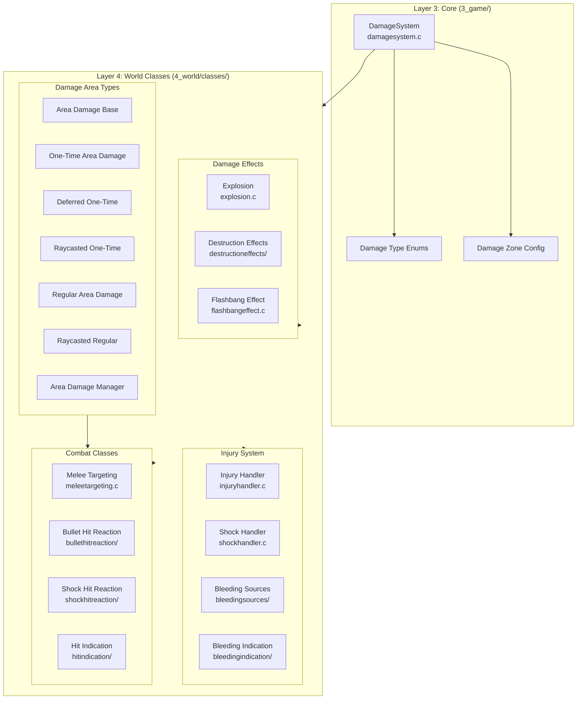
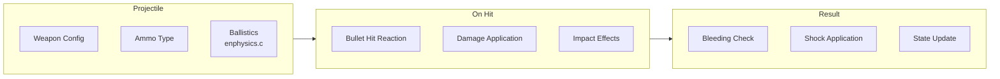
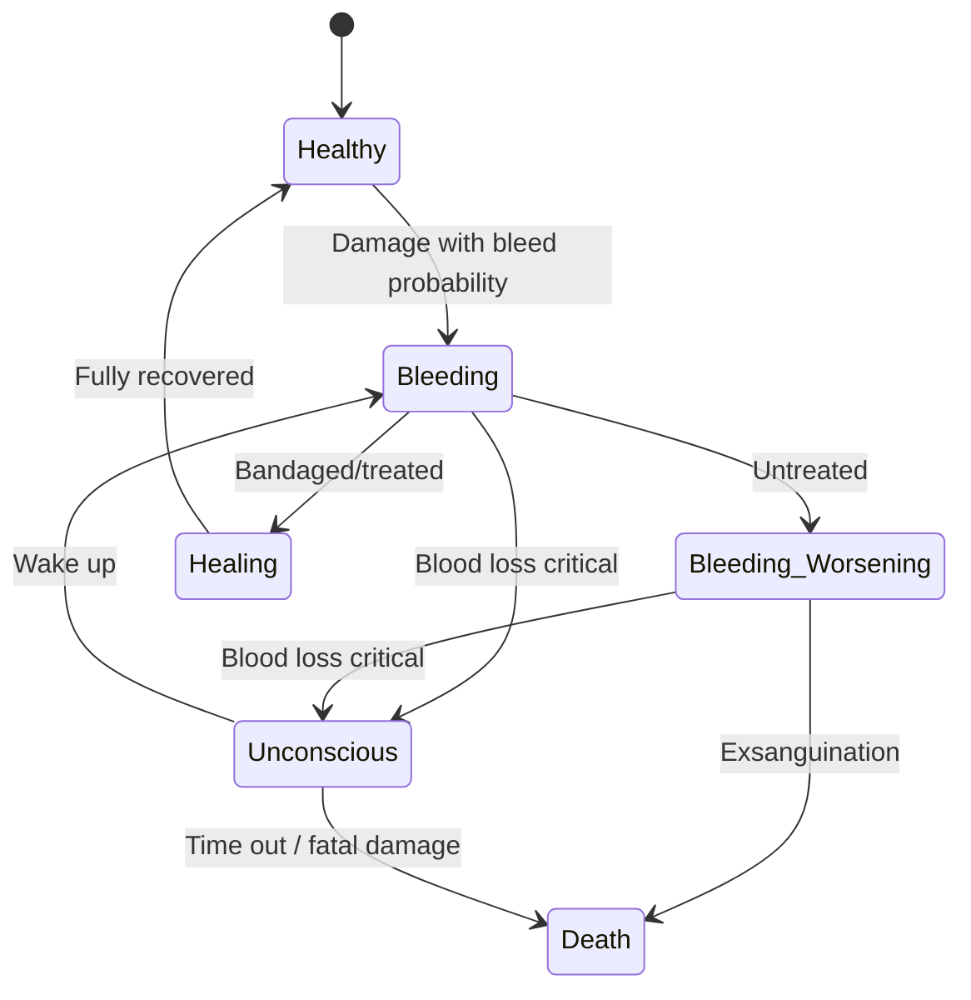
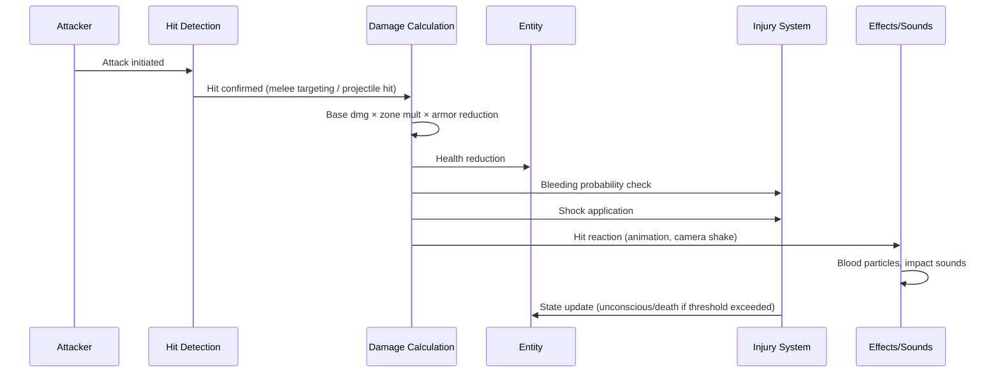

# Damage & Combat System

> **Looking for the implementation pipeline?** This page is the high-level conceptual overview (damage types, melee/firearm/explosion at a glance, injury state diagram). For the actual native damage pipeline — entry points (`ProcessDirectDamage`/`CloseCombatDamage`/`ExplosionDamage`), the `EEHitBy` → bleeding-source-spawn → `ShockHandler.CheckValue` → `InjuryAnimationHandler` → `EEKilled`/`KillerData` callback sequence, the bleeding-source lifecycle, and the area-damage system — see [Damage System (Native Pipeline)](./damage-system).

The damage system handles all forms of harm in DayZ: melee combat, firearms, explosions, environmental damage, and the resulting injuries, bleeding, shock, and unconsciousness. Core damage utilities live in `3_game/damagesystem.c` with gameplay classes in `4_world/classes/`.

## Architecture



## Damage Types

```c
enum DamageType {
    CLOSE_COMBAT,   // Melee weapons, fists
    FIRE_ARM,       // Bullets
    EXPLOSION,      // Explosives, grenades
    STUN,           // Stun/concussive
    CUSTOM          // Script-defined (for mods)
};
```

## DamageSystem (`3_game/damagesystem.c`)

A static utility class providing damage application:

```c
class DamageSystem {
    // Apply melee damage
    static void CloseCombatDamage(
        EntityAI victim, 
        EntityAI attacker, 
        float damage, 
        string component
    );
    
    // Apply explosion damage
    static void ExplosionDamage(
        EntityAI victim, 
        vector position, 
        float radius, 
        float damage
    );
    
    // Get damage zone mapping
    static ref map<string, int> GetDamageZoneMap();
    
    // Query total damage on a zone
    static float TotalDamageResult(
        EntityAI entity, 
        string zone, 
        int healthType
    );
};
```

## Damage Zones

Entities have multiple damage zones defined in config:

```c
// From scripts/config.cpp CfgSlots
// Damage zones typically include:
// HEAD, FACE, NECK, CHEST, STOMACH, 
// LEFT_ARM, RIGHT_ARM, LEFT_LEG, RIGHT_LEG
```

Each zone has:
| Property | Description |
|----------|-------------|
| **Health pool** | Separate health per zone; total health is zone-summed |
| **Armor value** | Damage reduction from worn clothing (config-defined per item) |
| **Bleeding probability** | Chance of causing a bleeding wound on hit |
| **Shock damage multiplier** | Multiplier for shock damage applied through this zone |
| **Hit reaction** | Animation/camera reaction triggered when this zone is hit |

Zone damage is calculated as: `finalDamage = baseDamage × zoneMultiplier × (1 - armorReduction)`

## Combat Types

### Melee Combat

Melee weapons include fists, knives, bats, axes, and other hand-to-hand weapons.

**Key files:**
- `HumanCommandMelee` / `HumanCommandMelee2` — Animation commands for melee attacks
- `4_world/classes/meleetargeting.c` — Hit detection and targeting
- `DZ/weapons/melee/config.cpp` — Melee weapon definitions

**Damage calculation:**
```
Melee Damage = Weapon Base Damage × Attack Type Multiplier × Zone Multiplier × Armor Reduction
```

Where:
- **Weapon base damage**: From config (`DZ/weapons/melee/config.cpp`)
- **Attack type**: Light (1.0×) or Heavy (1.5×) based on attack duration
- **Zone multiplier**: Head/neck receive more damage, limbs receive less
- **Armor reduction**: Worn clothing in the hit zone reduces damage

### Firearms

Firearm damage is a multi-step process involving projectile ballistics:



**Components involved:**
- **Projectile**: Defined in `DZ/weapons/projectiles/` with caliber, velocity, damage
- **Ballistics**: Handled by engine physics (`enphysics.c`) — trajectory, drop, velocity decay
- **Hit detection**: `bullethitreaction/` classes process impact events
- **Impact effects**: `ammoeffects.c`, `3_game/ammocamparams.c` for visual/audio feedback

### Explosions

```c
class ExplosionDamage {
    static void ApplyExplosion(
        vector position, 
        float radius, 
        float damage, 
        string ammoType
    );
};
```

Explosions have complex area-of-effect behavior:

| Property | Description |
|----------|-------------|
| **Damage falloff** | Damage decreases with distance from epicenter |
| **Shockwave** | Applies stun/knockback to entities within radius |
| **Structural damage** | Can damage buildings, walls, vehicles |
| **Component damage** | Individual body parts take separate damage |
| **Destruction effects** | Spawns debris particles via `destructioneffects/` |
| **Staggered delays** | Deferred damage variants for staggered area effects |

See the [Area Damage Classes](/script-layers/4-world#area-damage) in Layer 4 for the full hierarchy of area damage types (one-time, regular, raycasted, deferred, and their combinations).

## Injury System

The injury handler (`4_world/classes/injuryhandler.c`) manages injury states:



### Bleeding

- **Multiple bleeding sources**: Cuts (from sharp weapons), gunshot wounds (from firearms), laceration (from explosions)
- **Bleeding rate**: Depends on wound severity — light (slow drip), medium (steady flow), heavy (rapid loss)
- **Visual feedback**: Via `bleedingindication/` classes on HUD and screen effects
- **Treatment**: Bandages (quick fix), sewing kit (permanent repair), disinfectant (prevents infection)
- **Cumulative**: Multiple bleeding wounds stack their blood loss rate

### Shock

The `shockhandler.c` manages concussive/impact damage:

- **Triggered by**: Explosions, heavy melee impacts, severe falls, high-caliber gunshots
- **Effects**: Blurred vision, difficulty aiming, reduced movement speed, audio distortion
- **Progression**: Builds up over repeated impacts; decays slowly over time
- **Thresholds**: Low shock = minor screen effects; High shock = unconsciousness risk

## Combat Flow



## Related Config Files

- `DZ/weapons/data/` — Weapon damage values and properties
- `DZ/weapons/ammunition/` — Ammo types, caliber damage, penetration
- `DZ/gear/medical/` — Medical item effectiveness (bandages, morphine, etc.)
- `DZ/characters/data/` — Character armor values per zone
- `DZ/vehicles/data/` — Vehicle component damage resistance

## Related Systems

- **Player system**: Damage affects player stats and triggers animation states — see [Player System](./player-system)
- **Effect system**: Blood particles, impact sparks, explosion VFX — see [Effect System](./effect-system)
- **Sound system**: Weapon fire, melee hit, explosion, injury sounds — see [Sound System](./sound-system)
- **Animation system**: Hit reactions, death animations, unconscious state — see [Animation System](./animation-system)
- **Networking**: Damage events synced via RPC — see [Networking & RPC](./networking)
- **Vehicle system**: Vehicle collision damage, component damage — see [Vehicle System](./vehicle-system)
- **Data Config**: Weapon and ammo configs — see [Data Config: Weapons](/data-config/weapons)
