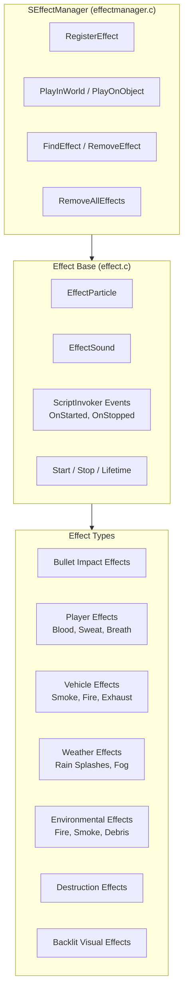
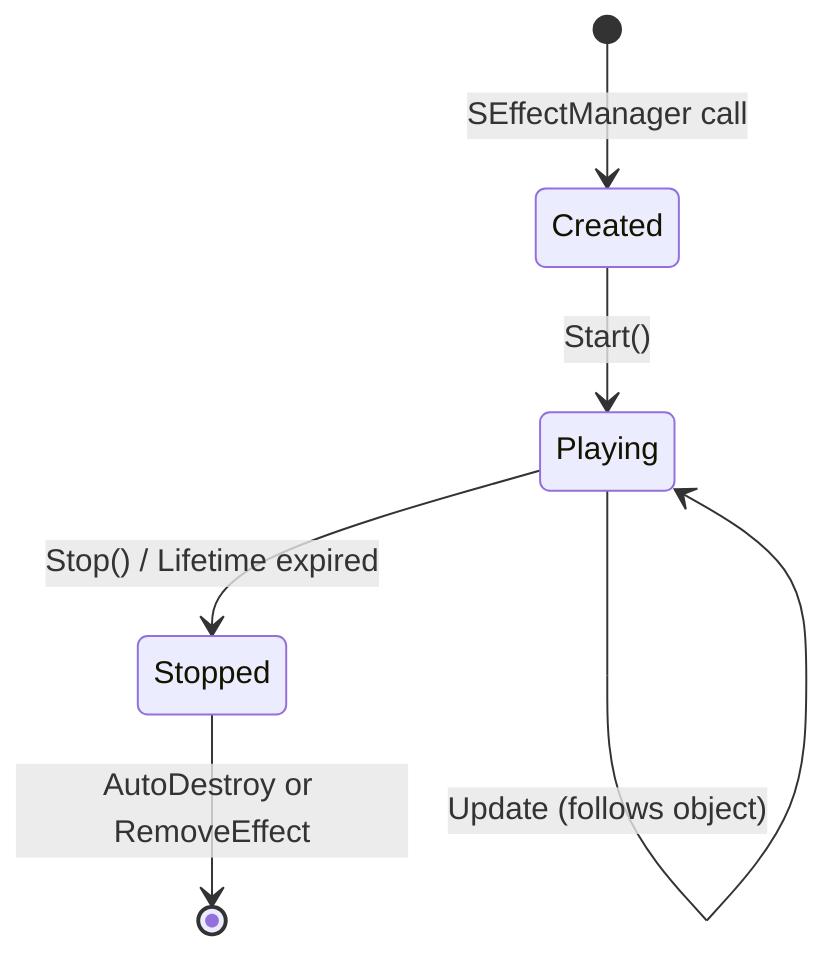

# Effect System

The effect system manages particle effects and sounds, providing a unified API for spawning, managing, and cleaning up visual and audio effects in the world. It bridges script-triggered events with the engine's particle and audio systems.

## Architecture



## Effect Base Class

### Properties

```c
class Effect {
    EffectParticle m_Particle;     // Attached particle system
    EffectSound m_Sound;           // Attached sound
    bool m_AutoDestroy;            // Auto-remove when finished
    float m_Lifetime;              // Effect lifetime (-1 = infinite, manual cleanup)
    
    // Event invokers
    ScriptInvoker OnStarted;       // Called when effect starts playing
    ScriptInvoker OnStopped;       // Called when effect stops playing
};
```

### Lifecycle

```c
class Effect {
    void Start();                  // Begin playing the effect
    void Stop();                   // Stop the effect early
    void SetObject(Object obj);    // Attach to an object (follows object)
    void SetPosition(vector pos);  // Position in world space (static)
    bool IsPlaying();              // Check if effect is currently active
};
```

**Lifecycle states:**



Events fire at key transitions via `ScriptInvoker`:

```c
// Subscribe to lifecycle events
Effect myEffect = SEffectManager.PlayOnObject("Explosion_Large", target);
myEffect.OnStarted.Insert(MyStartHandler);
myEffect.OnStopped.Insert(MyStopHandler);
```

## SEffectManager

The static singleton that manages all effects:

```c
class SEffectManager {
    // Play an effect in the world (position-based)
    static Effect PlayInWorld(
        string effectName,
        vector position,
        float lifetime = -1
    );
    
    // Play an effect on an object (follows object movement)
    static Effect PlayOnObject(
        string effectName,
        Object target,
        string memoryPoint = "",
        float lifetime = -1
    );
    
    // Register/query effects
    static void RegisterEffect(string name, Effect effect);
    static Effect FindEffect(int id);
    static void RemoveEffect(int id);
    
    // Bulk operations
    static void RemoveAllEffects();
};
```

### Parameter Details

| Parameter | Type | Description |
|-----------|------|-------------|
| `effectName` | `string` | Registered effect name from config |
| `target` | `Object` | Object to attach effect to (follows transforms) |
| `memoryPoint` | `string` | Named attachment point on the object (e.g., "usti hlavne" for muzzle flash) |
| `position` | `vector` | World-space position for static effects |
| `lifetime` | `float` | Duration in seconds; `-1` = indefinite (manual Stop required) |

## Effect Types

### EffectParticle

Particle-based visual effects used across all systems:

| Category | Examples |
|----------|---------|
| **Bullet impacts** | Sparks on metal, dust on concrete, blood on flesh, wood splinters |
| **Player effects** | Blood spray on hit, sweat droplets, breath vapor in cold |
| **Vehicle effects** | Engine smoke (white = overheating, black = damaged), exhaust, fire, tire dust |
| **Weather effects** | Rain splashes on surfaces, fog particle layers, snowflakes |
| **Environmental** | Fire (campfire, fireplace), smoke columns, explosion debris, dust devils |

### EffectSound

Sound-based audio effects attached to the effect lifecycle:

| Category | Examples |
|----------|---------|
| **Footsteps** | Surface-specific footstep sounds (dirt, concrete, metal, gravel, water) |
| **Weapon sounds** | Fire, reload, bolt action, mechanics, bullet impact |
| **Environmental** | Wind, rain, thunder, insects, ambient |
| **Character** | Voice (pain, death), breathing, coughing, sneezing |
| **Vehicle** | Engine start/stop/idle/rev, horn, crash, tire screech |

## Effect Parameters

Effects can be configured with runtime parameters for flexible reuse:

```c
// Example: Creating a bullet impact effect with custom parameters
Effect impact = SEffectManager.PlayOnObject(
    "BulletImpact_Concrete",   // Effect name (from config)
    targetObject,              // Hit object
    hitMemoryPoint,            // Memory point on object
    2.0                        // Lifetime in seconds
);

if (impact) {
    impact.OnStopped.Insert(OnImpactDone);
    
    // Configure parameters at runtime
    impact.m_Particle.SetParameter("size", 1.5);
    impact.m_Sound.SetVolume(0.8);
}
```

## Effect Config Data

Effects are defined in config files:

```cpp
// In DZ/ via CfgEffects or similar
class CfgEffects {
    class BulletImpact_Concrete {
        particle = "bullet_impact_concrete";  // Particle system name
        sound = "bullet_impact_concrete";      // Sound set name
        lifetime = 2.0;                        // Default lifetime
    };
    
    class Explosion_Large {
        particle = "explosion_large";
        sound = "explosion_large";
        lifetime = 5.0;
        shakeCamera = 1;                        // Trigger camera shake
    };
};
```

## Integration with Other Systems

- **Damage system**: Spawns blood/impact effects on hit, explosion VFX — see [Damage & Combat](./damage-combat)
- **Weather system**: Controls rain/snow particle effects, fog visual layers — see [Weather & Environment](./weather-environment)
- **Vehicle system**: Engine smoke, tire dust, exhaust fire — see [Vehicle System](./vehicle-system)
- **Player system**: Breath vapor in cold environments, headlamp light effects — see [Player System](./player-system)
- **Animation system**: Animation events trigger particle/spawn effects at specific frames — see [Animation System](./animation-system)
- **Sound system**: Combined effect objects play synchronized particle + sound — see [Sound System](./sound-system)
- **Environment**: Ambient particle effects (dust, insects, fireflies) via WorldData biome queries
- **Destruction**: Building/object destruction effects through `destructioneffects/` classes
