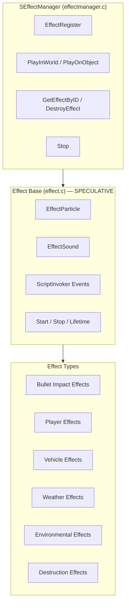

# Effect System

> **⚠️ Important:** This page has been corrected to use verified `SEffectManager` method signatures. The `Effect` base class internal members (`Start`, `Stop`, `SetObject`, `SetPosition`, `m_Particle`, `m_Sound`, etc.) have **not been independently verified** and are marked as **[speculative]**.

The effect system manages particle effects and sounds, providing a unified API for spawning, managing, and cleaning up visual and audio effects in the world. It bridges script-triggered events with the engine's particle and audio systems.

## Architecture



## SEffectManager

The static singleton that manages all effects. These are the **verified** member signatures (from `3_game/effectmanager.c`):

```c
class SEffectManager {
    // Play a pre-built Effect in the world (position-based)
    // Returns an effect ID (int), or INVALID_ID (0) on failure
    static int PlayInWorld(notnull Effect eff, vector pos);

    // Play a pre-built Effect on an object (follows object movement)
    static int PlayOnObject(notnull Effect eff, Object obj,
                             vector local_pos = "0 0 0",
                             vector local_ori = "0 0 0",
                             bool force_rotation_relative_to_world = false);

    // Stop an effect by its ID
    static void Stop(int effect_id);

    // Register an Effect instance for later lookup
    static int EffectRegister(Effect effect);

    // Lookup / query
    static Effect GetEffectByID(int effect_id);
    static bool IsEffectExist(int effect_id);

    // Destroy / unregister
    static void DestroyEffect(Effect effect);
    static void EffectUnregister(int id);
    static void EffectUnregisterEx(Effect effect);

    // Sound convenience methods
    static EffectSound CreateSound(string sound_set, vector position,
                                    float play_fade_in = 0, float stop_fade_out = 0,
                                    bool loop = false, bool enviroment = false);
    static EffectSound PlaySound(string sound_set, vector position,
                                  float play_fade_in = 0, float stop_fade_out = 0,
                                  bool loop = false);
    static EffectSound PlaySoundOnObject(string sound_set, Object parent_object,
                                          float play_fade_in = 0,
                                          float stop_fade_out = 0,
                                          bool loop = false);
    static bool DestroySound(EffectSound sound_effect);

    // Lifecycle
    static void Init();
    static void Cleanup();
    static void OnUpdate(float timeslice);

    // Internal
    static const int INVALID_ID = 0;
};
```

### Key Differences from Fabricated API

The previous version of this page contained fabricated method names and signatures. Here are the corrections:

| Fabricated (OLD) | Verified (CORRECT) |
|---|---|
| `PlayInWorld(string effectName, vector position, float lifetime)` | `PlayInWorld(notnull Effect eff, vector pos)` — takes a pre-built `Effect` object, NOT a string name |
| `PlayOnObject(string effectName, Object target, string memoryPoint, float lifetime)` | `PlayOnObject(notnull Effect eff, Object obj, vector local_pos, vector local_ori, bool force_rotation_relative_to_world)` — no string name, no "memoryPoint" string |
| `RegisterEffect(string name, Effect effect)` | `EffectRegister(Effect effect)` — no name string |
| `FindEffect(int id)` | `GetEffectByID(int effect_id)` |
| `RemoveEffect(int id)` | `DestroyEffect(Effect effect)` — takes Effect object, not int ID |
| `RemoveAllEffects()` | Does NOT exist — use `Cleanup()` or individual `DestroyEffect` calls |

## Usage Pattern

Because `PlayInWorld` and `PlayOnObject` take a pre-built `Effect` object (not a string name), the typical usage pattern is:

```c
// 1. Create/obtain an Effect instance
Effect myEffect = GetGame().GetWorld().CreateEffect("SomeEffectConfig");

// 2. Play it in the world
int effectID = SEffectManager.PlayInWorld(myEffect, someWorldPosition);

// 3. Later, look it up or destroy it
if (SEffectManager.IsEffectExist(effectID)) {
    Effect existing = SEffectManager.GetEffectByID(effectID);
    SEffectManager.DestroyEffect(existing);
}
```

> **[speculative]** The exact mechanism for creating `Effect` instances (e.g., `World.CreateEffect()` or config lookups) varies. Modders typically obtain effects via config-defined templates that the engine instantiates.

## Effect Base Class — Speculative

> **⚠️ The following `Effect` class members have NOT been independently verified against the script source.** They are retained from the original page for context but should be treated as illustrative only.

```c
class Effect {  // [speculative members]
    EffectParticle m_Particle;     // Attached particle system
    EffectSound m_Sound;           // Attached sound
    bool m_AutoDestroy;            // Auto-remove when finished
    float m_Lifetime;              // Effect lifetime (-1 = infinite)

    void Start();                  // Begin playing
    void Stop();                   // Stop early
    void SetObject(Object obj);    // Attach to object
    void SetPosition(vector pos);  // Position in world space
    bool IsPlaying();              // Check if active

    ScriptInvoker OnStarted;       // Fired when effect starts
    ScriptInvoker OnStopped;       // Fired when effect stops
};
```

## Effect Types — Speculative

> **[speculative]** The following effect type descriptions are gameplay observations, not verified from source code.

### EffectParticle

Particle-based visual effects:

| Category | Examples |
|----------|---------|
| **Bullet impacts** | Sparks on metal, dust on concrete, blood on flesh, wood splinters |
| **Player effects** | Blood spray on hit, sweat droplets, breath vapor in cold |
| **Vehicle effects** | Engine smoke, exhaust, fire, tire dust |
| **Weather effects** | Rain splashes, fog particle layers, snowflakes |
| **Environmental** | Fire, smoke columns, explosion debris |

### EffectSound

Sound-based audio effects:

| Category | Examples |
|----------|---------|
| **Footsteps** | Surface-specific footstep sounds |
| **Weapon sounds** | Fire, reload, bolt action, bullet impact |
| **Environmental** | Wind, rain, thunder, insects, ambient |
| **Character** | Voice, breathing, coughing |
| **Vehicle** | Engine, horn, crash, tire screech |

## Integration with Other Systems

- **Damage system**: Spawns blood/impact effects on hit, explosion VFX — see [Damage & Combat](./damage-combat)
- **Weather system**: Controls rain/snow particle effects, fog visual layers — see [Weather & Environment](./weather-environment)
- **Vehicle system**: Engine smoke, tire dust, exhaust fire — see [Vehicle System](./vehicle-system)
- **Player system**: Breath vapor in cold environments — see [Player System](./player-system)
- **Animation system**: Animation events trigger particle/spawn effects — see [Animation System](./animation-system)
- **Sound system**: Combined effect objects play synchronized particle + sound — see [Sound System](./sound-system)
- **Destruction**: Building/object destruction effects through `destructioneffects/` classes
