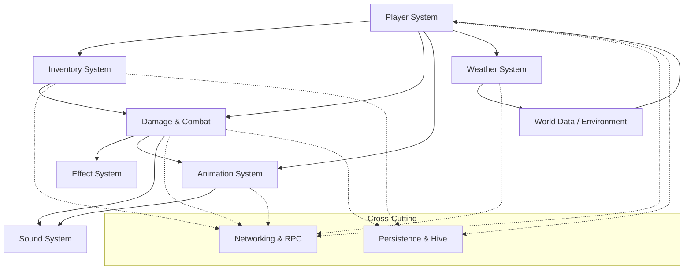

# Game Systems

This section documents the major game systems in DayZ, their architecture, how they interact, and their implementation in the script layers.

## Systems Overview

| System | Primary Files | Layer | Purpose |
|--------|--------------|-------|---------|
| [Player System](./player-system) | `3_game/dayzgame.c`, `3_game/dayzplayer.c`, `3_game/human.c`, `4_world/entities/dayzplayerimplement*.c` | Layers 3-4 | Game singleton, player entity, input, camera, movement |
| [Inventory System](./inventory-system) | `3_game/systems/inventory/`, `4_world/classes/inventoryactionhandler.c` | Layers 3-4 | Item management, storage, equipment, hand FSM |
| [User Actions System](./user-actions-system) | `4_world/classes/useractionscomponent/` | Layer 4 | Context-sensitive interactions: eating, doors, crafting, weapon reloads |
| [Weapons & Firearms](./weapons-system) | `4_world/entities/firearms/`, `4_world/classes/weapons/weaponmanager.c`, `4_world/systems/inventory/` | Layers 3-4 | Weapon FSM, fire cycle, chambering/reloading, network sync |
| [Modifiers & Symptoms](./modifiers-symptoms-system) | `4_world/classes/playermodifiers/`, `playersymptoms/`, `playernotifiers/`, `transmissionagents/` | Layer 4 | Per-tick survival sim: metabolism, diseases, immune system, HUD notifiers, symptom animations |
| [Damage & Combat](./damage-combat) | `3_game/damagesystem.c`, `4_world/classes/damage/*`, `4_world/classes/injuryhandler.c` | Layers 3-4 | Melee, firearms, explosions, injuries, bleeding (conceptual overview) |
| [Damage System (Native Pipeline)](./damage-system) | `3_game/damagesystem.c`, `object.c`, `playerbase.c`, `dayzplayerimplement.c`, `bleedingsources/`, `shockhandler.c`, `injuryhandler.c`, `areadamage/` | Layers 3-4 | Native damage entry points, EEHitBy callback chain, bleeding lifecycle, shock→unconsciousness, death/KillerData |
| [Effect System](./effect-system) | `3_game/effect.c`, `3_game/effectmanager.c` | Layer 3 | Particles, sounds, visual effects |
| [Weather & Environment](./weather-environment) | `3_game/weather.c`, `3_game/worlddata.c`, `3_game/worldlighting.c` | Layer 3 | Rain, fog, wind, temperature, world state |
| [AI System](./ai-system) | `3_game/ai/`, `3_game/aibehaviour.c`, `3_game/entities/dayzinfected.c`, `3_game/entities/dayzanimal.c` | Layer 3 | Zombies, animals, AI agents, group behavior |
| [Vehicle System](./vehicle-system) | `3_game/vehicles/transport.c`, `3_game/vehicles/car.c`, `3_game/vehicles/boat.c`, `3_game/vehicles/helicopter.c` | Layer 3 | Car, boat, helicopter simulation |
| [Animation System](./animation-system) | `3_game/anim/`, `3_game/dayzanimevents.c`, `3_game/dayzanimeventmaps.c` | Layer 3 | Animation commands, events, state machines |
| [Sound System](./sound-system) | `3_game/sound.c`, `DZ/sounds/`, `4_world/classes/soundevents/` | Layers 3-4 + DZ | Audio playback, sound configs, occlusion |
| [Voice Communication](./voice-communication) | `3_game/vonmanager.c`, `DZ/gear/radio/` | Layer 3 + DZ | VoIP pipeline, proximity/radio/megaphone, voice state integration |
| [Networking & RPC](./networking) | `3_game/gameplay.c` (ScriptRPC), `3_game/vonmanager.c`, `3_game/playeridentity.c` | Layer 3 | Remote procedure calls, entity replication, voice chat |
| [Persistence & Hive](./persistence-hive) | `3_game/hive/`, `3_game/hive/hive*.c` | Layer 3 | Database persistence, player/world save/load |
| [Central Economy](./central-economy) | `3_game/ce/centraleconomy.c`, per-world CE XML configs | Layer 3 + CE config | Loot spawning, economy management, item lifetime tracking |
| [Crafting & Cooking](./crafting-cooking-system) | `4_world/classes/craftingmanager.c`, `recipes/`, `cooking/`, `foodstage/`, `entities/itembase/edible_base.c`, `fireplacebase.c` | Layer 4 | Recipe plugin system, cooking pipeline, food stage transitions |
| [Base Building](./base-building-system) | `4_world/entities/itembase/basebuildingbase.c`, `classes/basebuilding/`, `classes/hologram.c`, `kitbase.c` | Layer 4 | Kit deploy, construction parts, hologram placement, dismantle/fold |
| [Environment System](./environment-system) | `4_world/classes/environment/environment.c`, `heatcomfortanimhandler.c`, `rainprocurement*`, `worlddata.c` | Layers 3-4 | Per-player heat-comfort & wetness simulation, fire proximity, rain procurement |
| [Contaminated Areas](./contaminated-area-system) | `4_world/classes/contaminatedarea/`, `entities/scriptedentities/triggers/`, `playermodifiers/modifiers/areaexposure.c`, `contamination*.c` | Layer 4 | Gas/heat/geyser triggers, area-exposure→agent→modifier chain, mask protection, decontamination |
| [Explosion System](./explosion-system) | `3_game/entities/object.c`, `damagesystem.c`, `destructioneffects/destructioneffectbase.c`, `itembase/explosivesbase.c`, `grenade_base.c`, `trapbase/` | Layers 3-4 | `Object.Explode` → `DamageSystem.ExplosionDamage` pipeline, trap/grenade/remote lifecycles, destruction-effect chaining |

## How Systems Interact



### Key Interactions

1. **Player → Inventory → Damage**: The player interacts with items through the inventory system (hand FSM), which manages weapon equipping for combat. Item degradation feeds into the damage system when items break.

2. **Player → User Actions → World**: Nearly every context-sensitive interaction (eating, opening doors, bandaging, attaching attachments, crafting, weapon reloads) flows through the [User Actions System](./user-actions-system) — a client-authoritative-for-input, server-authoritative-for-effects pipeline using `ScriptInputUserData` (client→server) and sync junctures (server→client).

3. **Damage → Effects → Animation → Sound**: Taking damage triggers the damage system, which spawns visual effects (blood particles, impact sparks) through `SEffectManager`, drives hit-reaction animations via `HumanCommandDeath`/`HumanCommandUnconscious`, and plays impact sounds through the sound system.

4. **Weather → World → Player**: Weather components (rain, fog, wind, temperature) modify world data, which cascades to player status — wetness from rain accelerates heat loss, wind chill affects temperature, fog reduces visibility and AI detection ranges.

5. **AI → Player → Combat**: AI entities (infected, animals) detect players through sensory systems (sight, hearing, smell), enter combat states, and interact with the player via the damage system. AI behavior drives animation selection through animation commands.

6. **Player → Animation → Sound**: Player input flows through `HumanInputController` → `HumanCommandMove`/`HumanCommandMelee` → `HumanAnimInterface` (state machine) → skeletal animation. Animation events at specific frames trigger gameplay callbacks (footstep sounds, weapon fire, melee hit detection).

7. **All → Networking**: Every game system uses `ScriptRPC` to synchronize state changes across the network — inventory moves, health changes, animation state, vehicle positions, and voice chat all travel through the networking layer.

8. **All → Persistence**: Critical persistent state (player inventory, world objects, vehicle state, base building) is saved and loaded through the hive persistence protocol, using either local file storage or a remote HTTP database backend.

## System Architecture Layers


## Cross-Cutting Concerns

### Constants

Game-wide constants are defined in `3_game/constants.c` and `3_game/playerconstants.c`. These define thresholds and parameters consumed by all systems — health ranges, metabolic rates, temperature thresholds, movement speeds, and damage multipliers. Constants are evaluated at compile time and cannot change at runtime.

```c
// playerconstants.c — shared across all systems
const float PLAYER_MAX_HEALTH = 10000;
const float PLAYER_TEMPERATURE_NORMAL = 36.5;
const float PLAYER_METABOLISM_SPRINT_ENERGY = 0.144;
```

### Config Data (`DZ/`)

Object properties are defined in the `DZ/` config hierarchy and read at runtime by scripts. Config files define everything from weapon damage values to vehicle physics parameters to sound occlusion properties. The script-vs-config boundary is documented in [Architecture: Scripts vs Config](/architecture/script-vs-config).

### Events & Communication

Systems communicate through two primary decoupled mechanisms:

- **`ScriptInvoker`** (from `2_gamelib`): In-game event system allowing systems to subscribe to events without direct coupling. Used for animation events, effect lifecycle callbacks, and modifier state changes.
- **`ScriptRPC`**: Network-aware remote procedure calls for multi-player synchronization. See [Networking & RPC](./networking) for the full protocol.

### Script Layers

Game systems primarily live in **Layer 3** (`3_game/`) with some components extending into **Layer 4** (`4_world/`). The distinction is:
- **Layer 3**: Core game logic — systems, entities, base classes
- **Layer 4**: World simulation — gameplay actions, modifiers, sound events, crafting recipes

See [Script Layers](/script-layers/) for the full layering architecture.

## Related Documentation

- [Script Layers Overview](/script-layers/) — How the layer system organizes code
- [Architecture: Entity Hierarchy](/architecture/entity-hierarchy) — Base entity classes shared by all systems
- [World Gameplay](/world-gameplay/) — Player stats, stamina, soft skills
- [Data Config](/data-config/) — Config file structure for DZ/ data
