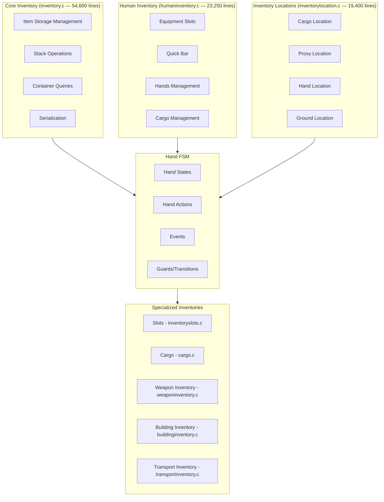
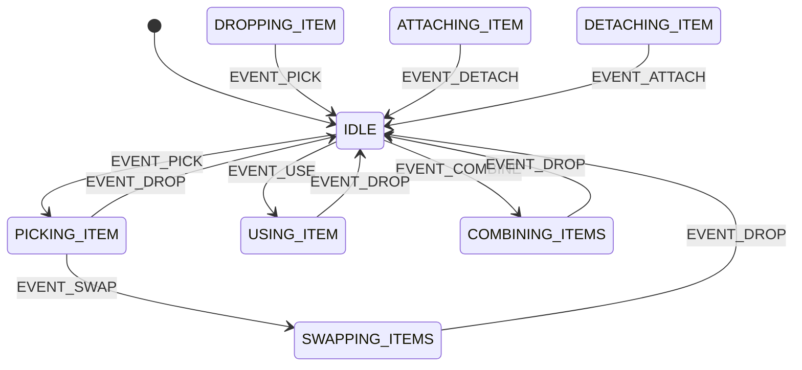
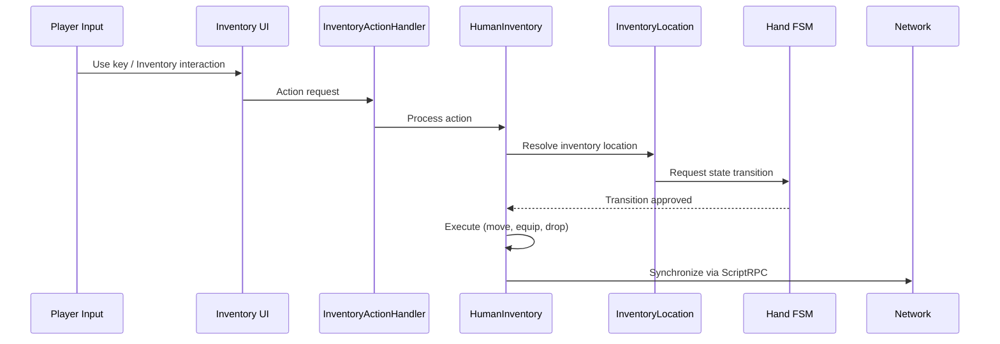

# Inventory System

The inventory system is one of the largest and most complex subsystems in DayZ. It manages item storage, movement, equipment, and the player's hand/item state machine. Located primarily in `3_game/systems/inventory/`, it spans ~140,000 lines across ~30 files.

## Architecture



## Core Concepts

### Inventory Locations

Every item exists at a location:

```c
enum InventoryLocationType {
    INVENTORY_LOCATION_CARGO,     // In a container's cargo
    INVENTORY_LOCATION_PROXY,     // Attached to a proxy slot (on-body)
    INVENTORY_LOCATION_HAND,      // In the player's hand
    INVENTORY_LOCATION_GROUND,    // On the ground
};
```

### Slot Types

Defined in `DZ/` configs and managed at runtime:

```c
// Common slot types (from scripts/config.cpp CfgSlots)
// Head, Shoulder, Melee, Bow, Headgear, Mask, Eyewear,
// Hands, LeftHand, Gloves, Armband, Vest, Body, Back,
// Hips, Legs, Feet, Pistol, Knife, magazine, Driver, Cargo
```

### Item Storage

```c
class InventoryItem : EntityAI {
    int GetWeight();              // Item weight in grams
    vector GetItemSize();         // Item dimensions (x, y)
    int GetQuantity();            // Current quantity (ammo, liquid, etc.)
    int GetMaxQuantity();         // Maximum quantity
    bool IsStackable();           // Can this item stack?
};
```

### Stacking Mechanics

Stackable items (ammunition, food, medical supplies) share the same `InventoryItem` class with quantity tracking:

- **Stacking**: Identical items can be merged into a single stack up to `GetMaxQuantity()`
- **Splitting**: Stacks can be divided via inventory actions
- **Quantity consumption**: Using a stackable item decrements the quantity; empty stacks auto-destroy
- **Weight calculation**: Stack weight = single item weight × quantity

## Hand State Machine

The hand FSM manages what the player is doing with their hands/items. The core files are:
- `hand_fsm.c` — State machine framework
- `hand_actions.c` — Action definitions
- `hand_events.c` — Event triggers
- `hand_guards.c` — Transition guard conditions
- `hand_states.c` — State implementations



**States:**
| State | Description |
|-------|-------------|
| `IDLE` | Hands free, no active item manipulation |
| `PICKING_ITEM` | Reaching for and grabbing an item |
| `DROPPING_ITEM` | Releasing an item from hands |
| `USING_ITEM` | Active item use (eating, drinking, reading) |
| `COMBINING_ITEMS` | Crafting or combining two items |
| `ATTACHING_ITEM` | Attaching item to a slot/attachment point |
| `DETACHING_ITEM` | Detaching item from a slot/attachment point |
| `SWAPPING_ITEMS` | Swapping between two held items |

**Transitions are triggered by events:**
```c
enum HandEvent {
    EVENT_PICK,
    EVENT_DROP,
    EVENT_USE,
    EVENT_COMBINE,
    EVENT_ATTACH,
    EVENT_DETACH,
    EVENT_SWAP
};
```

## Human Inventory Flow



## Key Files

### `inventory.c` (54,600 lines)

The core inventory logic:
- **Container management**: Add, remove, find items in containers
- **Stack operations**: Merge, split, transfer stacks
- **Weight/capacity**: Calculate total weight, enforce capacity limits
- **Serialization**: Save/load inventory state for persistence
- **Query**: Find items by type, slot, or location with filters

### `humaninventory.c` (23,250 lines)

Human-specific inventory:
- **Equipment slots**: Manages worn items (headgear, vest, backpack, etc.)
- **Quick bar**: Manages the 1-9 quick bar slots for rapid item access
- **Hands**: Manages the currently held item and hand state
- **Cargo**: Manages backpack/storage cargo

### `inventorylocation.c` (19,400 lines)

Abstraction layer for where items can be:
- **CargoLocation**: Items in container cargos (backpacks, boxes, vehicles)
- **ProxyLocation**: Items attached to proxy slots on the body
- **HandLocation**: Items held in hands
- **GroundLocation**: Items on the ground (world objects)

## Inventory Action Handler (`4_world/classes/`)

The Layer 4 inventory action handler processes user interaction with inventory:

```c
class InventoryActionHandler {
    void HandleAction(EntityAI item, EntityAI target);
    bool CanCombine(EntityAI item1, EntityAI item2);
    void ProcessCrafting(EntityAI item1, EntityAI item2);
};
```

This bridges the core inventory system with world-level gameplay actions. See [Layer 4: World](/script-layers/4-world) for the complete action hierarchy.

## Related Config Files

Inventory slot types and container dimensions are defined in config:

```cpp
// DZ/gear/containers/config.cpp
class CfgSlots {
    slot Back {
        // Backpack slot configuration
    };
    slot Vest {
        // Vest slot configuration
    };
};
```

Container capacities and item sizes are defined per item:

```cpp
class CfgInventory {
    class Item_Base {
        weight = 100;         // Weight in grams
        itemSize[] = {1, 2};  // Width, Height in inventory grid units
        quantityBar = 1;      // Show quantity bar
        stackMax = 10;        // Maximum stack size
    };
};
```

## Interaction with Other Systems

- **Damage system**: Items take damage and degrade; damaged items have reduced effectiveness
- **Crafting system**: Inventory items are used as crafting ingredients via `RecipeBase`
- **Cooking system**: Food items in inventory are used for cooking
- **Medical system**: Medical items are applied from inventory via actions
- **Network**: Inventory changes are synced via RPC — see [Networking & RPC](./networking)
- **Persistence**: Inventory state is saved to the hive database — see [Persistence & Hive](./persistence-hive)
- **Animation**: Item interactions trigger animation events — see [Animation System](./animation-system)
- **Data Config**: Item properties defined in `DZ/` configs — see [Data Config: Gear & Items](/data-config/gear-items)
