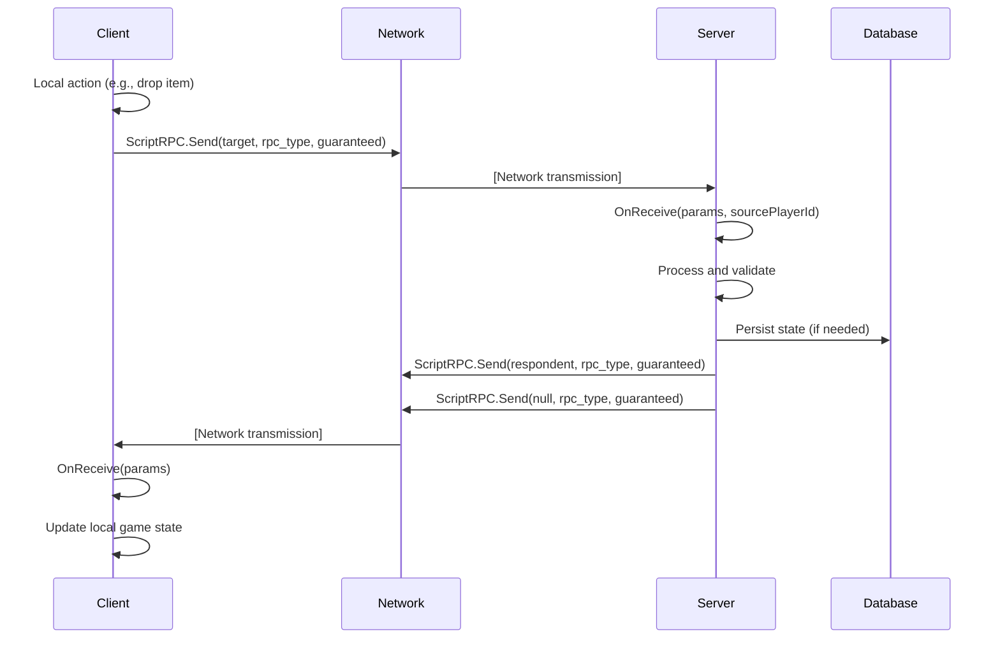
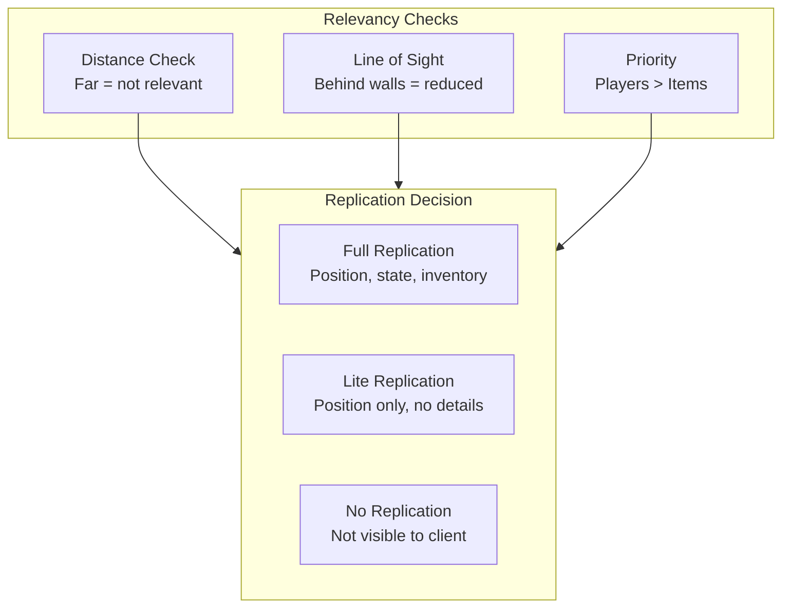

# Networking & RPC

The networking system handles multiplayer synchronization, remote procedure calls, and voice communication. It is primarily built on the `ScriptRPC` system defined in `3_game/gameplay.c`, with `ScriptInputUserData` for client input and `VONManager` for voice.

## Architecture

```mermaid
flowchart TD
    subgraph RPC["ScriptRPC System (3_game/gameplay.c)"]
        SEND[Send — Object target, int rpc_type, bool guaranteed, PlayerIdentity recipient=NULL]
        RECV[OnReceive]
        SER[Write / Read Serialization]
    end
    
    subgraph Input["Client Input"]
        SIUD[ScriptInputUserData<br/>Action serialization]
    end
    
    subgraph Identity["Player Identity"]
        PID[PlayerIdentity<br/>ID, Name, Ping]
    end
    
    subgraph Voice["Voice Communication<br/>(see Voice Communication)]
        VON[VONManager<br/>Proximity / Radio / Megaphone]
    end
    
    subgraph Sync["Entity Synchronization"]
        POS[Position/Rotation<br/>Interpolated]
        HEALTH[Health/Damage<br/>Event-based]
        INV[Inventory Changes<br/>RPC-based]
        ANIM[Animation State<br/>Snapshot + Interpolation]
    end
    
    subgraph Replication["Replication System"]
        OWN[Ownership<br/>Client-owned entities]
        REL[Relevancy<br/>Distance / LoS / Priority]
    end
    
    RPC --> Sync
    RPC --> Input
    RPC --> Voice
    Sync --> Replication
```

## ScriptRPC

ScriptRPC is the primary mechanism for script-level network communication:

```c
class ScriptRPC {
    // Send an RPC
    void Send(Object target, int rpc_type, bool guaranteed, PlayerIdentity recipient = NULL);
    
    // Receive RPC
    void OnReceive(Param params, int sourcePlayerId);
    
    // Serialization
    void Write(ParamSerializer serializer);
    void Read(ParamSerializer serializer);
};
```

### RPC Flow



## RPC Best Practices

### RPC Types

RPCs are identified by an `rpc_type` integer ID. Send to server by calling `Send` without a `recipient` parameter; send to a specific client by passing the `PlayerIdentity` as recipient.

### Validation (Server-Side)

Always validate incoming RPCs on the server to prevent cheating:

```c
class MyRPC : ScriptRPC {
    override void OnReceive(Param params, int sourcePlayerId) {
        // 1. Verify player exists and is connected
        PlayerIdentity identity = GetPlayerIdentity(sourcePlayerId);
        if (!identity) return;
        
        // 2. Validate parameters are within expected ranges
        Param1<float> position = Param1<float>.Cast(params);
        if (!position || position.param1 < -1000 || position.param1 > 1000) return;
        
        // 3. Check cooldown / rate limiting
        if (!CheckCooldown(sourcePlayerId)) return;
        
        // 4. Verify the player is authorized for this action
        
        // 5. Process valid request
        ProcessAction(sourcePlayerId, position.param1);
    }
};
```

### Reliability Strategy

| Use Case | Transport | Reasoning |
|----------|-----------|-----------|
| Inventory moves | **Reliable** | Must arrive; missed = desync |
| Health changes | **Reliable** | Critical state must be consistent |
| Position updates | **Unreliable** | Latest state replaces earlier; frequent updates |
| Animation state | **Unreliable** | Snapshot-based; interpolation handles gaps |
| Voice data | **Unreliable** (UDP) | Low latency > perfect delivery |
| Chat messages | **Reliable** | Must arrive in order |

### Bandwidth Optimization

```c
// DO: Pack multiple values into a single RPC
class PackedPlayerState {
    void Write(ParamSerializer serializer) {
        serializer.WriteFloat(m_Health);
        serializer.WriteFloat(m_Blood);
        serializer.WriteInt(m_State);
        serializer.WriteBool(m_IsInVehicle);
    }
};

// DON'T: Send each value as a separate RPC
// (creates overhead from multiple network packets)
```

### Error Handling

```c
class SafeRPC : ScriptRPC {
    override void Send(Object target, int rpc_type, bool guaranteed, PlayerIdentity recipient = NULL) {
        if (!GetGame().IsServer() && recipient) return;  // Client shouldn't target specific recipients
        super.Send(target, rpc_type, guaranteed, recipient);
    }
    
    override void OnReceive(Param params, int sourcePlayerId) {
        if (!GetGame().IsServer()) return;  // Only server processes receives
        super.OnReceive(params, sourcePlayerId);
    }
};
```

## ScriptInputUserData

Handles client input serialization over the network:

```c
class ScriptInputUserData {
    // Input data is serialized automatically by the engine
    // The server reads inputs to validate and process player actions
};
```

This system allows the server to validate and process player inputs with authority.

## Player Identity

Players are identified by `PlayerIdentity`:

```c
class PlayerIdentity {
    string GetId();                 // Player ID string
    string GetPlainId();            // Plain/numeric player ID
    string GetName();               // Player display name
    int GetPingAct();               // Current/actual ping in ms
    int GetPingAvg();               // Average ping in ms
    int GetPingMin();               // Minimum ping in ms
    int GetPingMax();               // Maximum ping in ms
};
```

## Network Synchronization

### Entity Replication

Entity state is synchronized through multiple mechanisms:

| Property | Method | Update Rate |
|----------|--------|-------------|
| **Position/rotation** | Interpolated (smooth movement) | 10-30 Hz |
| **Health/damage** | Event-based (immediate on change) | On-change |
| **Inventory changes** | RPC-based (per action) | On-action |
| **Animation state** | Snapshot + interpolation | 5-10 Hz |
| **Vehicle state** | Physics sync + correction | 10-20 Hz |

### Ownership

Entity ownership is managed at the engine level and determines:
- **Authority**: Which client has authoritative control over an entity
- **Replication priority**: Owned entities get higher update priority
- **Input processing**: Owner input is applied to controlled entities

### Relevancy

Not all entities are replicated to all clients — the relevancy system optimizes bandwidth:



**Relevancy factors:**
- **Distance-based**: Entities far from the player aren't replicated
- **Line of sight**: Behind-walls check reduces unnecessary updates
- **Priority**: Players and vehicles get higher update frequency than ground items
- **Aggregation**: Distant entities update less frequently and with lower precision

## Bandwidth Considerations

- **RPC reliability**: Critical actions use reliable delivery (TCP-like); frequent state updates use unreliable (UDP-like)
- **Update rate**: Position updates at 10-30 Hz; less critical state at 1-5 Hz
- **Compression**: Vectors are quantized to reduce precision; floats are packed to fewer bits
- **Delta compression**: Only changed state is sent, not full snapshots
- **Batching**: Multiple small updates can be batched into a single packet

## Integration with Other Systems

- **All game state changes**: Inventory, health, position, animation all use RPC for synchronization
- **VON**: Voice chat uses UDP for low-latency transmission — see [Voice Communication](./voice-communication) and [Sound System](./sound-system)
- **Persistence**: Hive system uses server-to-database communication — see [Persistence & Hive](./persistence-hive)
- **Player system**: Player identity and input handling — see [Player System](./player-system)
- **Inventory system**: Inventory changes synced across all clients — see [Inventory System](./inventory-system)
- **Vehicle system**: Vehicle position, damage, passenger state — see [Vehicle System](./vehicle-system)
