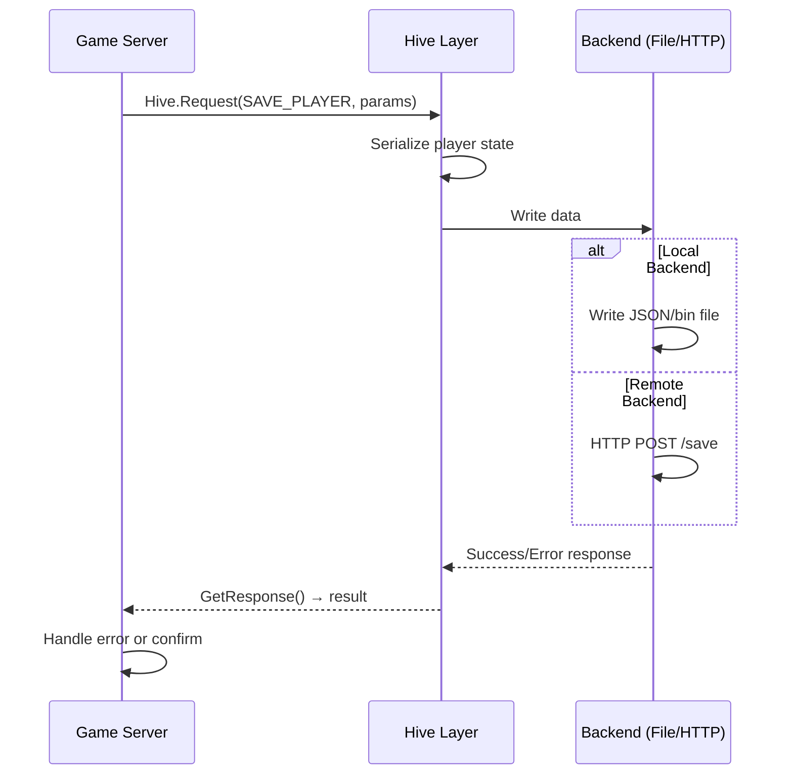

# Persistence & Hive System

The hive system is DayZ's persistence layer, connecting the game server to a backend database for saving and loading persistent game state. It uses a request/response protocol with support for both local file-based storage and remote HTTP database backends.

## Architecture

```mermaid
flowchart TD
    subgraph GameServer["Game Server"]
        subgraph Hive["Hive Protocol (3_game/hive/)"]
            REQ[Request / Response]
            SER[Serialization]
            TYPES[Request Types<br/>Login, Save, Load, Delete]
        end
        
        subgraph PersistentObjects["Persistent Objects"]
            PLAYER[Player Data<br/>Position, Vitals, Inventory]
            WORLD[World State<br/>Items, Containers, Doors]
            VEHICLE[Vehicle State<br/>Position, Health, Inventory]
            BUILDING[Base Building<br/>Constructions, Caches]
        end
    end
    
    subgraph Backends["Hive Backend"]
        LOCAL[Local (File-based)<br/>storage_1/]
        REMOTE[Remote (HTTP Database)<br/>API Endpoint]
    end
    
    subgraph SaveCycle["Save/Load Cycle"]
        AUTO[Periodic Auto-save<br/>~5 min interval]
        DISCONNECT[Player Disconnect]
        SHUTDOWN[Server Shutdown]
        STARTUP[Server Startup]
        DEATH[Player Death → Corpse]
    end
    
    GameServer --> Backends
    SaveCycle --> Hive
    PersistentObjects --> Hive
```

## Hive Protocol

The hive uses a synchronous request/response protocol:

```c
class Hive {
    // Send a request to the hive backend
    bool Request(int requestType, Param params);
    
    // Check for and read response
    bool GetResponse(out Param response);
    
    // Common request types
    const int REQUEST_LOGIN = 0;
    const int REQUEST_LOGOUT = 1;
    const int REQUEST_SAVE_PLAYER = 2;
    const int REQUEST_LOAD_PLAYER = 3;
    const int REQUEST_SAVE_WORLD = 4;
    const int REQUEST_LOAD_WORLD = 5;
    const int REQUEST_SAVE_VEHICLE = 6;
    const int REQUEST_LOAD_VEHICLE = 7;
    const int REQUEST_DELETE_OBJECT = 8;
};
```

### Protocol Flow



## Persistent Data

### Player Persistence

When a player connects or disconnects, their full state is saved/loaded:

```c
class DayZPlayer {
    void Save() {
        // Serialize and persist:
        // - World ID and position (coordinates)
        // - Health, blood, energy, water, temperature
        // - Inventory (all items, quantities, conditions)
        // - Equipment (worn items with attachments)
        // - Skills and soft skills
        // - Quick bar configuration
        // - Modifier states (diseases, injuries)
    }
    
    void Load() {
        // Deserialize and restore:
        // - Position (spawn at saved location)
        // - Vitals (health, blood, hunger, thirst)
        // - Inventory (all items restored)
        // - Equipment (worn items restored)
        // - Skills (persistent progression)
    }
};
```

```c
// Example: Saving player data
void SavePlayer(DayZPlayer player, Hive hive) {
    // Build parameter set
    Param param = new Param();
    param.WriteString(player.GetIdentity().GetSteamId());
    param.WriteVector(player.GetPosition());
    param.WriteFloat(player.GetHealth());
    param.WriteFloat(player.GetBlood());
    param.WriteFloat(player.GetEnergy());
    param.WriteFloat(player.GetWater());
    // ... inventory serialization ...
    
    // Send to hive
    if (hive.Request(Hive.REQUEST_SAVE_PLAYER, param)) {
        Param response;
        if (hive.GetResponse(response)) {
            // Verify save succeeded
        }
    }
}
```

### World Persistence

The world state is periodically saved to maintain persistence of dynamic objects:

```c
class WorldData {
    void SaveWorld() {
        // Save all persistent objects:
        // - Ground items (position, quantity, damage)
        // - Container contents (backpacks, boxes, barrels)
        // - Building damage states (doors, windows)
        // - Door/open/close states
        // - Base building objects (walls, gates, caches)
        // - Vehicle positions and state
        // - Plant/garden states
    }
    
    void LoadWorld() {
        // Load and spawn all persistent objects
        // - Spawn items at saved positions
        // - Restore container contents
        // - Apply building damage states
        // - Set door states
        // - Restore base building constructions
    }
};
```

### Persistent Object Interface

Objects that should persist implement the `PersistentObject` interface:

```c
class PersistentObject {
    // Serialization methods
    void OnStoreSave(ParamsSerializer serializer);
    void OnStoreLoad(ParamsSerializer serializer);
    
    // Lifecycle
    bool IsPersistent();           // Should this object persist?
    int GetPersistentID();         // Unique persistent identifier
};
```

To make a custom object persist:

```c
class MyCustomContainer : EntityAI, PersistentObject {
    override void OnStoreSave(ParamsSerializer serializer) {
        // Save custom state
        serializer.WriteInt(m_MyCustomValue);
        serializer.WriteString(m_MyCustomString);
    }
    
    override void OnStoreLoad(ParamsSerializer serializer) {
        // Restore custom state
        m_MyCustomValue = serializer.ReadInt();
        m_MyCustomString = serializer.ReadString();
    }
    
    override bool IsPersistent() {
        return true;  // This object survives server restarts
    }
};
```

## Save Triggers

| Event | What Saves | Frequency |
|-------|-----------|-----------|
| **Player disconnect** | Player data (position, vitals, inventory, skills) | On disconnect |
| **Periodic auto-save** | World state (items, containers, buildings, vehicles) | Configurable interval (default ~5 min) |
| **Server shutdown** | Everything (players + world) | On graceful shutdown |
| **Player death** | Player inventory → corpse (lootable body) | On death |
| **Item dropped** | Item position and state | On drop from inventory |
| **Building constructed** | Construction position and state | On place/upgrade |
| **Container modified** | Container contents | On inventory change |

## Data Flow

```mermaid
flowchart TD
    subgraph SavePath["Save Path"]
        TRIGGER[Save Trigger] --> SERIALIZE[Serialize State]
        SERIALIZE --> HIVE_REQ[Hive.Request()]
        HIVE_REQ --> BACKEND[Backend Storage]
    end
    
    subgraph LoadPath["Load Path"]
        START[Server Start] --> LOAD_TRIGGER[Load Event]
        LOAD_TRIGGER --> LOAD_REQ[Hive Request Load]
        LOAD_REQ --> BACKEND2[Backend Query]
        BACKEND2 --> DESERIALIZE[Deserialize State]
        DESERIALIZE --> APPLY[Apply to Game World]
    end
    
    subgraph Backends2["Backend Types"]
        FILE[File-based<br/>storage_1/]
        HTTP[HTTP API<br/>Remote Database]
    end
    
    BACKEND --> Backends2
    BACKEND2 --> Backends2
```

## Hive Backends

### Local (File-based)

For development, singleplayer, and dedicated servers without a remote database:

```
Server directory structure:
storage_1/
├── players/
│   ├── <steam_id>.json       — Player data (JSON format)
│   ├── <steam_id>.vars       — Player variables/state
│   └── <steam_id>_<world>.bin — Per-world player data
├── world/
│   ├── objects.bin           — World object state (binary)
│   ├── vehicles.bin          — Vehicle state
│   ├── building.bin          — Building damage state
│   └── <instance_id>/        — Instance-specific data
└── global/
    └── economy.bin           — Global economy/loot data
```

Advantages: No external dependencies, simple setup, no network latency.
Disadvantages: Not scalable to server networks, no centralized data.

### Remote (HTTP Database)

For production server networks with a centralized database:

```c
class HTTPHive : Hive {
    string m_APIEndpoint;       // Database API URL
    string m_APIToken;          // Authentication token
    
    bool SendRequest(string endpoint, string data);
    string GetResponse();
};
```

Advantages: Shared persistence across server network, scalable, backup support.
Disadvantages: Requires external infrastructure, network latency, potential for data loss on connection failure.

### Error Handling

```c
class RobustHive : Hive {
    void SaveWithRetry(int requestType, Param params, int maxRetries = 3) {
        for (int i = 0; i < maxRetries; i++) {
            if (Request(requestType, params)) {
                Param response;
                if (GetResponse(response)) {
                    return;  // Success
                }
            }
            // Wait before retry
            Sleep(1000);
        }
        // Log failure after max retries
        Error("Hive save failed after " + maxRetries + " attempts");
    }
};
```

## Integration with Other Systems

- **Player system**: Player data persistence (position, vitals, inventory) — see [Player System](./player-system)
- **Inventory system**: Item state persistence (positions, quantities, conditions) — see [Inventory System](./inventory-system)
- **Vehicle system**: Vehicle state persistence (position, health, fuel, inventory) — see [Vehicle System](./vehicle-system)
- **Base building**: Construction and cache persistence
- **Economy**: Global loot economy persistence (loot table state, item distribution)
- **Server**: Save/load cycle management (startup load, shutdown save, periodic auto-save)
- **Networking**: Server-to-database communication for remote hive backends — see [Networking & RPC](./networking)
