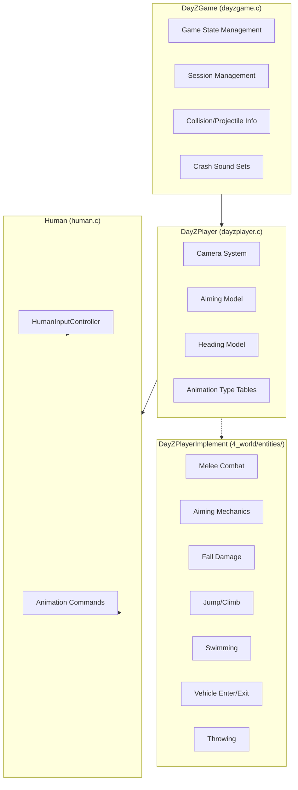
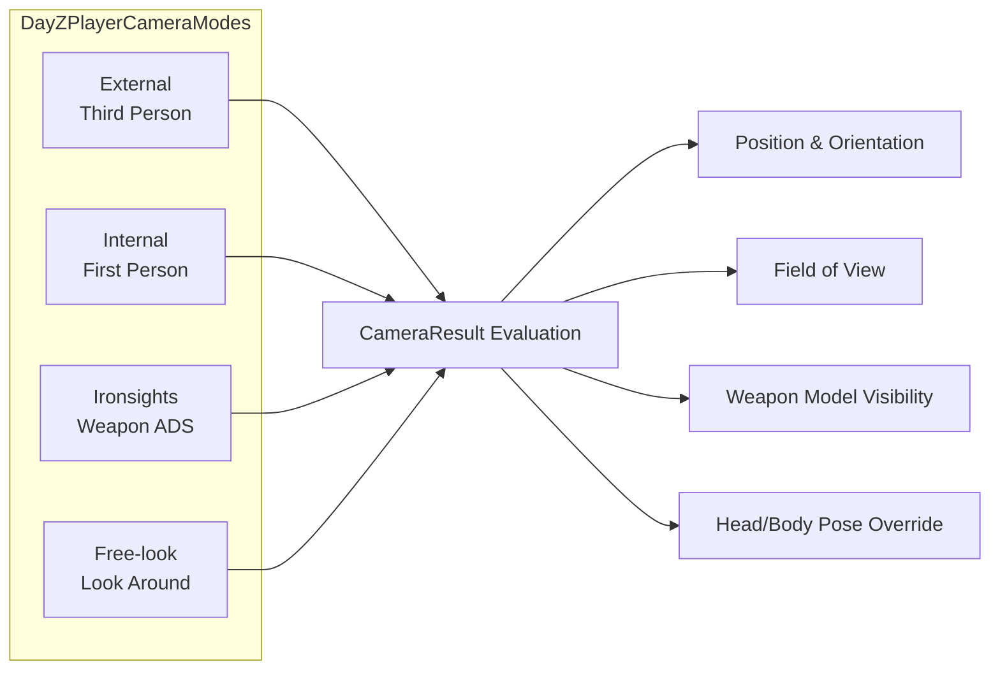
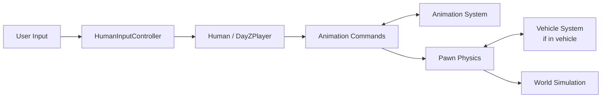

# Player System

The player system is the central actor in DayZ. It spans from the `DayZGame` singleton that manages game state, through the `DayZPlayer` entity that represents the player in the world, down to the `HumanInputController` that processes user input. Player-specific implementation details live in `4_world/entities/dayzplayerimplement*.c`.

## Architecture



## DayZGame (`dayzgame.c`)

The singleton game instance (`g_Game`), extending `CGame` (from `2_gamelib`).

### Game States

```c
enum DayZGameState {
    MAIN_MENU,
    LOGIN,
    PLAYING,
    // ... additional states
};
```

### Responsibilities

- **Session management**: Connect/disconnect to servers, login queue handling
- **Load states**: Manages loading phase progression
- **Collision/projectile info**: Handles `ProjectileStoppedInfo`, `ObjectCollisionInfo`, `TerrainCollisionInfo`
- **Crash sound sets**: Manages vehicle crash audio configurations

### Key Methods

```c
class DayZGame {
    // State management
    void StartGame();                 // Start a game session
    void EndGame();                   // End current session
    void Login();                     // Initiate login
    void Logout();                    // Initiate logout
    
    // World access
    ScriptedWorld GetWorld();         // Get current world
    DayZPlayer GetPlayer();           // Get local player
    
    // Config access
    float GetConfigFloat(int id, string path);
    string GetConfigString(int id, string path);
};
```

## DayZPlayer (`dayzplayer.c`)

The player avatar, extending `Human`. Located at `3_game/dayzplayer.c` (~1,400 lines). Core player entity that manages camera, aiming, heading, and animation type selection.

### Camera System

The camera system handles all player viewpoint management with four distinct modes:



```c
class DayZPlayerCamera {
    CameraResult Evaluate(float pDt, int pCameraMode);
};

// Camera modes
enum DayZPlayerCameraMode {
    EXTERNAL,       // Third person
    INTERNAL,       // First person
    IRONSIGHTS,     // Weapon ironsights
    FREELOOK,       // Free-look camera
};
```

The `DayZPlayerCameraResult` struct contains:
- Camera position and orientation
- Field of view
- Weapon model visibility
- Head/body pose overrides

### Weapon Handling

```c
class SDayZPlayerAimingModel {
    float m_fWeaponRaiseTime;       // Time to raise weapon
    float m_fWeaponLowerTime;       // Time to lower weapon
    float m_fHandsAimAnimSpeed;     // Aim animation speed
    float m_fDefaultHandsAimBlend;  // Default aim blend
};
```

### Animation Type Tables

`DayZPlayerTypeAnimTable` maps player states to animation sets:
- Idle / walking / running / sprinting
- Armed / unarmed
- Injured limping
- Swimming
- Climbing

## DayZPlayerImplement (`4_world/entities/`)

The Layer 4 player implementation extends `DayZPlayer` with concrete gameplay mechanics across multiple files:

| File | Purpose |
|------|---------|
| `dayzplayerimplement.c` | Main player implementation entry point |
| `dayzplayerimplementaiming.c` | Weapon aiming mechanics (sway, recoil compensation) |
| `dayzplayerimplementfalldamage.c` | Fall damage calculation based on velocity and height |
| `dayzplayerimplementheading.c` | Character rotation and heading control |
| `dayzplayerimplementjumpclimb.c` | Jump and climb movement mechanics |
| `dayzplayerimplementmeleecombat.c` | Melee combat implementation (hit detection, damage) |
| `dayzplayerimplementswimming.c` | Swimming movement and physics |
| `dayzplayerimplementthrowing.c` | Item throwing mechanics |
| `dayzplayerimplementvehicle.c` | Vehicle enter/exit and passenger logic |
| `dayzplayersyncjunctures.c` | Player state juncture synchronization |
| `dayzplayerutils.c` | Player utility functions |

See [Layer 4: World](/script-layers/4-world) for the full file listing.

## Human (`human.c`)

Extends `Man`. Provides shared humanoid functionality (~1,700 lines). The base class for both players and AI humanoids.

### HumanInputController

The input controller translates raw input into game actions:

```c
class HumanInputController {
    // Movement
    void OnMovement(float forward, float right);
    void OnStance(int stance);
    void OnSprint(bool active);
    
    // Combat
    void OnMelee();
    void OnWeaponRaise();
    void OnAim(bool active);
    
    // Interaction
    void OnFreeLook(bool active);
    void OnUse();
    void OnInteract();
};
```

### Animation Commands

```c
enum HumanCommand {
    HumanCommandMove,       // Locomotion (walk, run, sprint, crouch, prone)
    HumanCommandMelee,      // Melee attacks (light)
    HumanCommandMelee2,     // Power melee attacks (heavy)
    HumanCommandFall,       // Falling
    HumanCommandDeath,      // Death animation
    HumanCommandUnconscious // Unconscious state
};
```

Each command maps to a dedicated animation system handled in `3_game/anim/` — see the [Animation System](./animation-system) for details.

## Player Constants (`playerconstants.c`)

Defines all player stat thresholds and rates:

**Health thresholds**:
```c
const float PLAYER_HEALTH_CRITICAL = 1000;
const float PLAYER_HEALTH_LOW = 3000;
const float PLAYER_HEALTH_NORMAL = 5000;
const float PLAYER_HEALTH_HIGH = 7000;
const float PLAYER_MAX_HEALTH = 10000;
```

**Metabolic rates** (energy/water loss per second):
```c
const float PLAYER_METABOLISM_IDLE_ENERGY = 0.018;
const float PLAYER_METABOLISM_WALK_ENERGY = 0.036;
const float PLAYER_METABOLISM_JOG_ENERGY = 0.072;
const float PLAYER_METABOLISM_SPRINT_ENERGY = 0.144;
```

**Temperature thresholds**:
```c
const float PLAYER_TEMPERATURE_HOT = 42.0;
const float PLAYER_TEMPERATURE_NORMAL = 36.5;
const float PLAYER_TEMPERATURE_COLD = 35.0;
const float PLAYER_TEMPERATURE_FREEZING = 30.0;
```

## Data Flow



## Related Systems

- **Camera system** interacts with the animation system for head/body positioning
- **Inventory** is accessed through the `EntityAI` base class — see [Inventory System](./inventory-system)
- **Damage** is handled via `HumanCommandDeath`, `HumanCommandUnconscious`, and the `DamageSystem` — see [Damage & Combat](./damage-combat)
- **Effects** spawn on the player entity through `SEffectManager` — see [Effect System](./effect-system)
- **Network synchronization** uses `ScriptRPC` for player state replication — see [Networking & RPC](./networking)
- **Player stats** (hunger, thirst, health, blood) are managed in `4_world/classes/playermodifiers/` — see [World Gameplay: Player Stats](/world-gameplay/player-stats)
- **Animation** commands drive all player motion — see [Animation System](./animation-system)
