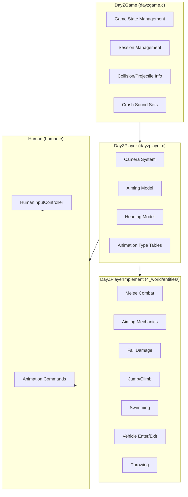
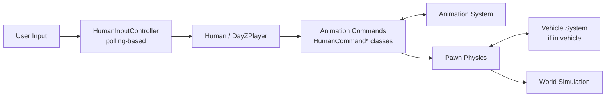

# Player System

The player system is the central actor in DayZ. It spans from the `DayZGame` singleton that manages game state, through the `DayZPlayer` entity that represents the player in the world, down to the `HumanInputController` that processes user input. Player-specific implementation details live in `4_world/entities/dayzplayerimplement*.c`.

## Architecture



## DayZGame (`dayzgame.c`)

The singleton game instance (`g_Game`), extending `CGame` (from `2_gamelib`).

### Game States

> **[speculative]** The `DayZGameState` enum and its values have not been independently verified:

```c
// [speculative — not verified against source]
enum DayZGameState {
    MAIN_MENU,
    LOGIN,
    PLAYING,
    // ... additional states
};
```

### Responsibilities

- **Session management**: Connect/disconnect to servers, login queue handling
- **Load states**: Manages loading phase progression
- **Collision/projectile info**: Handles `ProjectileStoppedInfo`, `ObjectCollisionInfo`, `TerrainCollisionInfo`
- **Crash sound sets**: Manages vehicle crash audio configurations

### Key Methods

> **⚠️ Correction:** `DayZGame` has **0 verified public members** in the script source. The following methods were fabricated in a previous version and do NOT exist:
>
> - ❌ `StartGame()`, `EndGame()`, `Login()`, `Logout()`
> - ❌ `GetWorld()`, `GetPlayer()`
> - ❌ `GetConfigFloat()`, `GetConfigString()`
>
> `DayZGame` extends `CGame` (from `3_game/global/game.c`). Game state management is handled through the engine (`g_Game` singleton). Access world/player via `GetGame().GetWorld()` and related engine APIs.

## DayZPlayer (`dayzplayer.c`)

The player avatar, extending `Human`. Located at `3_game/dayzplayer.c` (~1,400 lines). Core player entity that manages camera, aiming, heading, and animation type selection.

### Camera System

The camera system handles all player viewpoint management. `DayZPlayerCamera` (in `3_game/dayzplayer.c`) is the base class with **0 members**. It is extended by `DayZPlayerCameraBase` (in `4_world/`), which provides the real implementation:

```c
// DayZPlayerCameraBase — verified API
class DayZPlayerCameraBase : DayZPlayerCamera {
    void OnUpdate(float pDt, out DayZPlayerCameraResult pOutResult);
    void OnActivate(DayZPlayerCamera pPrevCamera, DayZPlayerCameraResult pPrevCameraResult);
    vector GetBaseAngles();
    vector GetAdditiveAngles();
    string GetCameraName();
};
```

**Concrete camera subclasses** (NOT enum values):

| Class | View |
|-------|------|
| `DayZPlayerCamera1stPerson` | First person |
| `DayZPlayerCamera3rdPerson` | Third person |
| `DayZPlayerCameraIronsights` | Weapon ironsights/ADS |
| `DayZPlayerCamera3rdPersonVehicle` | Third person in vehicles |

The `DayZPlayerCameraResult` struct contains:
- Camera position and orientation
- Field of view
- Weapon model visibility
- Head/body pose overrides

> **Correction:** There is NO `Evaluate` method and NO `enum DayZPlayerCameraMode`. The previous version fabricated both. Camera modes are implemented as **separate classes** extending `DayZPlayerCameraBase`, each overriding `OnUpdate`.

### Weapon Handling

> **[speculative]** The `SDayZPlayerAimingModel` struct and its members have not been independently verified:

```c
// [speculative — not verified against source]
class SDayZPlayerAimingModel {
    float m_fWeaponRaiseTime;       // Time to raise weapon
    float m_fWeaponLowerTime;       // Time to lower weapon
    float m_fHandsAimAnimSpeed;     // Aim animation speed
    float m_fDefaultHandsAimBlend;  // Default aim blend
};
```

### Animation Type Tables

`DayZPlayerTypeAnimTable` maps player states to animation sets:
- Idle / walking / running / sprinting
- Armed / unarmed
- Injured limping
- Swimming
- Climbing

## DayZPlayerImplement (`4_world/entities/`)

The Layer 4 player implementation extends `DayZPlayer` with concrete gameplay mechanics across multiple files:

| File | Purpose |
|------|---------|
| `dayzplayerimplement.c` | Main player implementation entry point |
| `dayzplayerimplementaiming.c` | Weapon aiming mechanics (sway, recoil compensation) |
| `dayzplayerimplementfalldamage.c` | Fall damage calculation based on velocity and height |
| `dayzplayerimplementheading.c` | Character rotation and heading control |
| `dayzplayerimplementjumpclimb.c` | Jump and climb movement mechanics |
| `dayzplayerimplementmeleecombat.c` | Melee combat implementation (hit detection, damage) |
| `dayzplayerimplementswimming.c` | Swimming movement and physics |
| `dayzplayerimplementthrowing.c` | Item throwing mechanics |
| `dayzplayerimplementvehicle.c` | Vehicle enter/exit and passenger logic |
| `dayzplayersyncjunctures.c` | Player state juncture synchronization |
| `dayzplayerutils.c` | Player utility functions |

See [Layer 4: World](/script-layers/4-world) for the full file listing.

## Human (`human.c`)

Extends `Man`. Provides shared humanoid functionality (~1,700 lines). The base class for both players and AI humanoids.

### HumanInputController

The input controller translates raw input into game actions. **The API is polling-based** (not event/callback-based). Verified methods:

```c
class HumanInputController {
    // Enable/disable input
    proto native void SetDisabled(bool pState);
    
    // Movement (polling)
    proto void GetMovement(out float pSpeed, out vector pLocalDirection);
    proto native float GetHeadingAngle();
    proto native vector GetAimChange();
    proto native vector GetAimDelta(float dt);
    proto native vector GetTracking();
    
    // Camera
    proto native bool CameraViewChanged();
    proto native bool CameraIsFreeLook();
    proto native void ResetFreeLookToggle();
    proto native bool CameraIsTracking();
    proto native bool Camera3rdIsRightShoulder();
    
    // Stance / movement mode
    proto native bool IsStanceChange();
    proto native bool IsJumpClimb();
    proto native bool IsWalkToggled();
    proto native bool IsThrowingModeChange();
    proto native void ResetThrowingMode();
    
    // Weapon
    proto native bool WeaponWasRaiseClick();
    proto native bool IsWeaponRaised();
    proto native bool WeaponADS();
    proto native void ResetADS();
    
    // Melee
    proto native bool IsMeleeEvade();
    proto native bool IsMeleeFastAttackModifier();
    proto native int IsMeleeLREvade();
    proto native bool IsMeleeWeaponAttack();
    
    // Use / attack / interact
    proto native bool IsUseButton();
    proto native bool IsUseButtonDown();
    proto native bool IsUseItemButton();
    proto native bool IsUseItemButtonDown();
    proto native bool IsAttackButton();
    proto native bool IsAttackButtonDown();
    proto native bool IsSingleUse();
    proto native bool IsContinuousUse();
    proto native bool IsContinuousUseStart();
    proto native bool IsContinuousUseEnd();
    proto native bool IsImmediateAction();
    
    // Reload
    proto native bool IsReloadOrMechanismSingleUse();
    proto native bool IsReloadOrMechanismContinuousUse();
    proto native bool IsReloadOrMechanismContinuousUseStart();
    proto native bool IsReloadOrMechanismContinuousUseEnd();
    
    // Zoom
    proto native bool IsZoom();
    // ... (69 total members)
};
```

> **Correction:** There are NO `OnMovement`, `OnStance`, `OnSprint`, `OnMelee`, `OnWeaponRaise`, `OnAim`, `OnFreeLook`, `OnUse`, or `OnInteract` methods. The previous version fabricated event-style callbacks. The real API is **polling-based**: you query button/input state each frame via `Is*` methods and read movement via `GetMovement`.

### Animation Commands

Animation commands are **classes** (NOT an enum). They are created via `Human` methods:

```c
// On Human (human.c) — verified signatures
class Human {
    proto native HumanCommandMove StartCommand_Move();
    proto native HumanCommandMove GetCommand_Move();
    
    proto native HumanCommandMelee StartCommand_Melee(EntityAI pTarget);
    proto native HumanCommandMelee GetCommand_Melee();
    
    proto native HumanCommandMelee2 StartCommand_Melee2(
        EntityAI pTarget, int pHitType, float pComboValue,
        vector hitPos = vector.Zero);
    proto native HumanCommandMelee2 GetCommand_Melee2();
    
    proto native HumanCommandFall StartCommand_Fall(float pYVelocity);
    proto native HumanCommandFall GetCommand_Fall();
    
    proto native HumanCommandLadder StartCommand_Ladder(
        Building pBuilding, int pLadderIndex);
    proto native HumanCommandLadder GetCommand_Ladder();
    
    proto native HumanCommandSwim StartCommand_Swim();
    // ... also: HumanCommandDeath, HumanCommandUnconscious
    // ... (+ more commands)
};
```

| Class | Purpose |
|-------|---------|
| `HumanCommandMove` | Locomotion (walk, run, sprint, crouch, prone) |
| `HumanCommandMelee` | Melee attacks (light) |
| `HumanCommandMelee2` | Power melee attacks (heavy) |
| `HumanCommandFall` | Falling |
| `HumanCommandDeath` | Death animation |
| `HumanCommandUnconscious` | Unconscious state |
| `HumanCommandLadder` | Ladder climbing |
| `HumanCommandSwim` | Swimming |

> **Correction:** These are **NOT** `enum HumanCommand` values. They are individual script classes defined in `3_game/human.c`. Each command maps to a dedicated animation system.

## Player Constants (`playerconstants.c`)

`PlayerConstants` is a class with `static const float` members defining all player stat thresholds and rates. **Verified values:**

**Health thresholds:**
```c
class PlayerConstants {
    static const float SL_HEALTH_CRITICAL = 15;
    static const float SL_HEALTH_LOW = 30;
    static const float SL_HEALTH_NORMAL = 50;
    static const float SL_HEALTH_HIGH = 80;
};
```

**Blood thresholds:**
```c
    static const float SL_BLOOD_CRITICAL = 3000;
    static const float SL_BLOOD_LOW = 3500;
    static const float SL_BLOOD_NORMAL = 4000;
    static const float SL_BLOOD_HIGH = 4500;
```

**Energy thresholds:**
```c
    static const float SL_ENERGY_CRITICAL = 0;
    static const float SL_ENERGY_LOW = 300;
    static const float SL_ENERGY_NORMAL = 800;
    static const float SL_ENERGY_HIGH = 3500;
    static const float SL_ENERGY_MAX = 5000;
```

**Water thresholds:**
```c
    static const float SL_WATER_CRITICAL = 0;
    static const float SL_WATER_LOW = 300;
    static const float SL_WATER_NORMAL = 800;
    static const float SL_WATER_HIGH = 3500;
    static const float SL_WATER_MAX = 5000;
```

**Metabolic rates** (energy/water loss per second):
```c
    static const float METABOLIC_SPEED_ENERGY_SPRINT = 0.6;
    // ... (many other METABOLIC_SPEED_* constants)
```

**Temperature thresholds:**
```c
    static const float NORMAL_TEMPERATURE_L = 36.0;
    static const float NORMAL_TEMPERATURE_H = 36.5;
    static const float HIGH_TEMPERATURE_L = 38.5;
    static const float HIGH_TEMPERATURE_H = 39.0;
```

**Other notable constants:**
```c
    static const float DIGESTION_SPEED = 1.7;
    const int VOMIT_THRESHOLD = 2000;
    static const float HEAVY_HIT_THRESHOLD = 0.5;
    static const float HEAD_HEIGHT_ERECT = 1.6;
    static const float HEAD_HEIGHT_CROUCH = 1.05;
    static const float HEAD_HEIGHT_PRONE = 0.66;
    static const float BAREFOOT_MOVEMENT_BLEED_MODIFIER = 0.1;
    // ... (173 total members)
```

> **Correction:** The previous version used fabricated names (`PLAYER_HEALTH_*`, `PLAYER_METABOLISM_*`, `PLAYER_TEMPERATURE_*`, `PLAYER_MAX_HEALTH`) with wrong values. Real constants use `SL_*` prefix for stat levels and `NORMAL_TEMPERATURE_*`/`HIGH_TEMPERATURE_*` for temperature. There is no `PLAYER_MAX_HEALTH` (health uses the `SL_HEALTH_*` scale).

## Data Flow



## Related Systems

- **Camera system** interacts with the animation system for head/body positioning
- **Inventory** is accessed through the `EntityAI` base class — see [Inventory System](./inventory-system)
- **Damage** is handled via `HumanCommandDeath`, `HumanCommandUnconscious`, and the `DamageSystem` — see [Damage & Combat](./damage-combat)
- **Effects** spawn on the player entity through `SEffectManager` — see [Effect System](./effect-system)
- **Network synchronization** uses `ScriptRPC` for player state replication — see [Networking & RPC](./networking)
- **Player stats** (hunger, thirst, health, blood) are managed in `4_world/classes/playermodifiers/` — see [World Gameplay: Player Stats](/world-gameplay/player-stats)
- **Animation** commands drive all player motion — see [Animation System](./animation-system)
