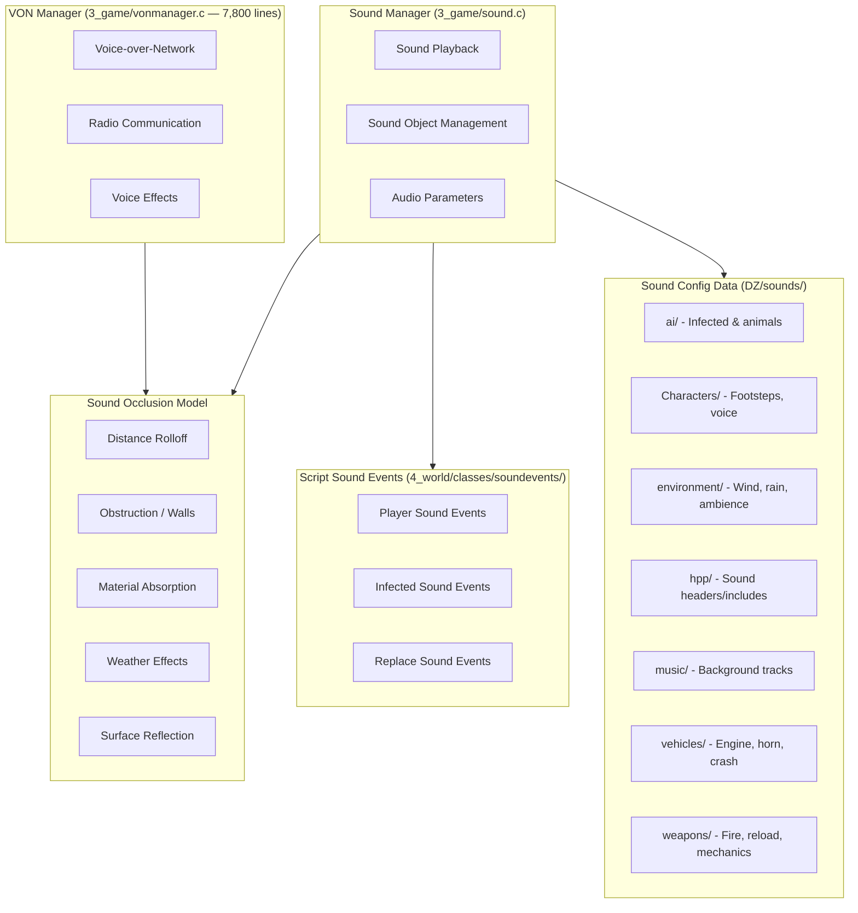

# Sound System

The sound system manages audio playback, spatial audio, voice communication, and all game sounds from footsteps to gunfire. It spans Layer 3 core logic (`3_game/sound.c`, `3_game/vonmanager.c`) and Layer 4 script events (`4_world/classes/soundevents/`), with config data in `DZ/sounds/`.

## Architecture



## Sound Manager

The core sound playback interface, providing methods for playing sounds in the world:

```c
class SoundManager {
    // Play a sound at a position in the world
    SoundObject PlaySound(string soundName, vector position);
    
    // Play a sound attached to an entity (follows it)
    SoundObject PlaySoundOnEntity(string soundName, EntityAI entity);
    
    // Play a looping ambient sound within a radius
    AmbientObject PlayAmbient(string soundName, vector position, float radius);
    
    // Stop sounds
    void StopSound(SoundObject sound);
    void StopAllSounds();
    
    // Audio parameters (master volume channels)
    void SetMasterVolume(float volume);
    void SetSFXVolume(float volume);
    void SetMusicVolume(float volume);
    void SetVoiceVolume(float volume);
};
```

## Sound Objects

```c
class SoundObject {
    // Playback control
    void Play();
    void Stop();
    void Pause();
    void Resume();
    
    // Parameters
    void SetVolume(float volume);
    void SetPitch(float pitch);
    void SetPosition(vector position);
    void SetLoop(bool loop);
    
    // 3D audio — spatialization
    void SetRolloff(float minDist, float maxDist);
    void SetOcclusion(float occlusion);
    
    // State queries
    bool IsPlaying();
    float GetDuration();
    float GetTime();
};
```

## Sound Config Data

Sounds are organized by category in `DZ/sounds/`:

```
DZ/sounds/
├── ai/             — Infected groans, screams, animal calls
├── Characters/     — Footsteps (per surface), breathing, pain, voice
├── environment/    — Wind, rain, thunder, insects, birds, ambience
├── hpp/            — Sound config includes and macros
├── music/          — Background music tracks, stingers
├── vehicles/       — Engine (start/idle/rev/stop), horn, crash, tires
└── weapons/        — Fire (per weapon), reload, bolt, mechanics
```

### Sound Config Format

Sounds are defined using a three-layer config system:

```cpp
// SoundShader — defines the audio sample and basic properties
class CfgSoundShaders {
    class AK47_Fire_SoundShader {
        samples[] = { { "DZ\sounds\weapons\ak47_fire", 1 } };
        volume = 0.9;
        range = 800;              // Max audible distance in meters
    };
};

// SoundSet — groups shaders with playback parameters
class CfgSoundSets {
    class AK47_Fire_SoundSet {
        soundShaders[] = { "AK47_Fire_SoundShader" };
        volumeFactor = 1.0;
        frequencyFactor = 1.0;
        spatial = 1;              // 3D spatialization enabled
    };
};
```

## VON (Voice Over Network)

The VON system (`vonmanager.c`, ~7,800 lines) handles real-time voice communication. See the full [Voice Communication](./voice-communication) page for the complete pipeline, player state integration, and radio equipment details.

```c
class VONManager {
    // Start/stop voice transmission
    void StartTransmitting();
    void StopTransmitting();
    bool IsTransmitting();
    
    // Radio communication
    void SetRadioFrequency(float frequency);
    bool IsRadioTransmitting();
    
    // Voice effects
    void SetVoiceEffect(VoiceEffectType effect);
    // VoiceEffectType: NORMAL, RADIO, DISTORTED, DISTANT
    
    // Volume/proximity
    float GetVoiceVolume();     // Based on distance to listener
    void SetVoiceCone(float angle, float radius);
};
```

### Voice Channels

```c
enum VoiceChannel {
    PROXIMITY,      // Local chat — hears based on distance and voice cone
    RADIO,          // Radio communication — party/frequency based, reduced quality
    MEGAPHONE       // Amplified voice — vehicle PA systems, megaphone item
};
```

| Channel | Range | Quality | Use Case |
|---------|-------|---------|----------|
| PROXIMITY | ~50m (configurable) | High, direct | Face-to-face communication |
| RADIO | Unlimited (frequency) | Reduced, compressed | Squad coordination |
| MEGAPHONE | ~200m | Amplified, distorted | Vehicle announcements, crowd control |

## Sound Occlusion

Sounds in DayZ use a multi-factor occlusion model for realistic audio propagation:

```c
class SoundOcclusion {
    // Calculate occlusion between source and listener
    static float GetOcclusion(vector source, vector listener);
    
    // Material-based sound absorption
    static float GetMaterialAbsorption(string materialType);
    
    // Environment reverb
    static float GetEnvironmentReverb(string environmentType);
};
```

### Occlusion Factors

| Factor | Effect | Implementation |
|--------|--------|----------------|
| **Distance** | Volume drops over distance via configurable rolloff curve | `SetRolloff(minDist, maxDist)` |
| **Obstructions** | Walls, buildings, terrain block/interfere with sound | Raycast-based occlusion check |
| **Materials** | Different materials transmit sound differently (concrete vs wood vs dirt) | `GetMaterialAbsorption()` per surface type |
| **Weather** | Wind direction carries sound further downwind; rain adds noise floor | Wind vector × distance, rain intensity |
| **Surfaces** | Sound reflection/echo from different surfaces (indoor reverb, outdoor open) | Environment reverb type |

```c
// Example: Sound propagation calculation
float CalculateAudibility(vector source, vector listener) {
    float baseVolume = 1.0;
    
    // Distance falloff
    float dist = vector.Distance(source, listener);
    baseVolume *= GetRolloffFactor(dist, minDist, maxDist);
    
    // Occlusion from obstacles
    float occlusion = SoundOcclusion.GetOcclusion(source, listener);
    baseVolume *= (1.0 - occlusion);
    
    // Weather modifier
    baseVolume *= GetWeatherSoundModifier(windSpeed, rainIntensity);
    
    return baseVolume;
}
```

## Sound Events (`4_world/classes/soundevents/`)

Script-defined sound events in Layer 4 provide a higher-level interface to the sound system:

```c
class SoundEvent {
    string m_SoundName;
    float m_Radius;
    float m_Duration;
    bool m_IsLooping;
    
    void OnPlay();
    void OnStop();
};
```

Sound event categories:

| Category | Directory | Examples |
|----------|-----------|---------|
| **Player** | `playersoundevents/` | Damage, drowning, heat comfort, hold breath, injury, jump, melee, stamina, symptoms |
| **Infected** | `infectedsoundevents/` | Mind state sounds (idle, alert, combat) |
| **Replace** | `replacesoundevents/` | Surface-based sound replacement (footsteps on different surfaces) |

### Sound Handlers

Additional sound management classes in Layer 4:

| Handler | Purpose |
|---------|---------|
| `freezingsoundhandler.c` | Shivering and cold-related sounds |
| `hungersoundhandler.c` | Stomach growling sounds |
| `injurysoundhandler.c` | Pain and injury vocalizations |
| `itemsoundhandler.c` | Item interaction sounds (picking up, dropping, equip) |
| `playersoundmanager.c` | Central player sound management |
| `thirstsoundhandler.c` | Dehydration-related sounds |

## Integration with Other Systems

- **Weapons system**: Fire, reload, mechanical, bullet impact sounds — see [Damage & Combat](./damage-combat)
- **Vehicle system**: Engine (start/idle/stop), horn, crash, tire screech — see [Vehicle System](./vehicle-system)
- **Player system**: Footsteps, breathing, pain, weather exposure sounds — see [Player System](./player-system)
- **AI system**: Infected groans, screams, animal calls; AI hearing uses sound events — see [AI System](./ai-system)
- **Weather system**: Wind, rain, thunder ambient sounds affect gameplay — see [Weather & Environment](./weather-environment)
- **Animation system**: Footstep events trigger surface-specific sound playback — see [Animation System](./animation-system)
- **Effect system**: Combined particle + sound effects via `EffectSound` — see [Effect System](./effect-system)
- **Voice Communication**: Full VoIP pipeline, voice channels, player state integration — see [Voice Communication](./voice-communication)
- **Network**: VON voice data transmission over UDP, sound event synchronization — see [Networking & RPC](./networking)
