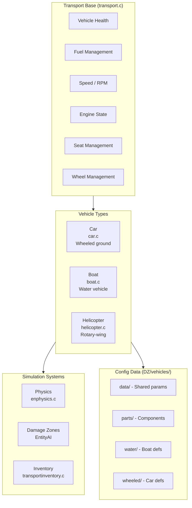
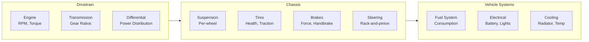
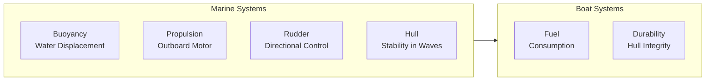
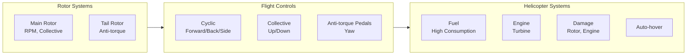

# Vehicle System

The vehicle system manages all drivable and ridable vehicles in DayZ, including cars, boats, and helicopters. Vehicles extend the `Pawn` class through the `Transport` base and implement full physics simulation for each vehicle type.

## Architecture



## Transport Base

The base vehicle class extends `Pawn` and provides shared functionality for all vehicle types:

```c
class Transport : Pawn {
    // Vehicle state
    float m_Health;
    float m_Fuel;
    float m_Speed;
    float m_RPM;
    
    // Component states
    bool m_EngineOn;
    bool m_LightsOn;
    bool m_IsLocked;
    
    // Seats
    int m_SeatCount;
    bool m_IsSeatOccupied[int];
    
    // Wheels/tracks
    int m_WheelCount;
    float m_WheelHealth[int];
    
    // Methods
    void EngineOn();
    void EngineOff();
    void LockDoors();
    void UnlockDoors();
    float GetSpeed();
    int GetOccupiedSeatCount();
};
```

## Car (`car.c`)

Wheeled vehicle simulation with full drivetrain modeling:

### Subsystems



- **Engine**: RPM-based torque curve, fuel consumption map, over-rev damage
- **Transmission**: Automatic gear shifting with configurable ratios
- **Suspension**: Per-wheel independent suspension, travel limits, damping
- **Tires**: Individual tire health, traction coefficient, pressure, puncture handling
- **Brakes**: Braking force, handbrake (locks rear wheels), ABS simulation
- **Steering**: Rack-and-pinion steering model with speed-dependent assist
- **Fuel**: Consumption based on RPM × load, tank capacity, fuel type

### Car Components

Cars are composed of replaceable parts, each with its own health and damage model:

| Component | Failure Effect | Repair Method |
|-----------|---------------|---------------|
| Engine | Reduced power → stalls → seized | Engine repair tools, spare parts |
| Tires (×4-6) | Reduced speed, poor handling, blowout | Tire repair kit, spare tire |
| Doors (×2-5) | Cannot enter, weather exposure | Duct tape, car parts |
| Windows (×2-6) | Weather exposure, reduced protection | Car parts |
| Headlights/Taillights | No lighting at night | Car parts, bulbs |
| Fuel tank | Fuel leak, fire risk | Duct tape, welding |
| Spark plugs | Engine misfire → won't start | Replacement spark plugs |
| Battery | Engine won't start, no electrics | Jump start, replacement battery |
| Radiator | Overheating → engine damage | Coolant refill, repair |
| Glow plug | Diesel hard start in cold | Replacement glow plug |
| Doors | Lock/unlock failure | Car parts, lockpicking |

### Car Physics

```c
class Car : Transport {
    // Physics parameters (from config)
    float m_MaxSpeed;
    float m_Acceleration;
    float m_BrakingForce;
    float m_SteeringAngle;
    float m_SuspensionTravel;
    float m_TireFriction;
    
    // Simulation update methods
    void UpdateWheelPhysics(float delta);
    void UpdateEngine(float delta);
    void UpdateTransmission(float delta);
};
```

## Boat (`boat.c`)

Water vehicle simulation with fluid dynamics:



```c
class Boat : Transport {
    // Water physics
    float m_BuoyancyForce;
    float m_Draft;               // How deep the hull sits
    float m_HullStability;       // Resistance to capsizing
    float m_MotorPower;
    
    // Navigation
    float m_RudderAngle;
    float m_WaterResistance;
};
```

- **Buoyancy**: Water displacement physics based on hull volume and weight
- **Propulsion**: Outboard motor simulation with RPM-power curve
- **Steering**: Rudder-based directional control (tiller or wheel)
- **Stability**: Hull stability in waves — rough water affects handling
- **Fuel**: Outboard motor fuel consumption
- **Damage**: Hull breaches cause flooding, reduced buoyancy

## Helicopter (`helicopter.c`)

Rotary-wing aircraft simulation with full flight dynamics:



```c
class Helicopter : Transport {
    // Rotor systems
    float m_MainRotorRPM;
    float m_TailRotorRPM;
    float m_CollectivePitch;
    float m_CyclicPitch;
    float m_AntiTorquePedal;
    
    // Flight state
    float m_Altitude;
    bool m_IsAutoHover;
    bool m_EngineFlameOut;
    
    // Simulation
    void UpdateRotorPhysics(float delta);
    void UpdateFlightDynamics(float delta);
};
```

- **Main rotor**: RPM governed by engine, collective pitch controls lift
- **Tail rotor**: Anti-torque control for directional stability (yaw)
- **Flight model**: Cyclic (pitch/roll), collective (vertical), pedals (yaw)
- **Auto-hover**: Stabilization system for stationary hover
- **Fuel**: High consumption — turbine engine
- **Damage**: Tail rotor loss = spin; Main rotor damage = crash; Engine flameout = autorotation

## Vehicle Inventory

Vehicles have inventory storage for cargo and parts:

| Inventory Type | Description |
|---------------|-------------|
| **Cargo** | Trunk/storage space (configurable capacity) |
| **Seats** | Passenger inventory access (seat storage) |
| **Attachment slots** | Spare tire mount, roof rack, weapon rack |
| **Fuel tank** | Fuel quantity (not standard inventory, separate system) |

Vehicle storage is managed through `transportinventory.c` and `buildinginventory.c`.

## Vehicle Config Data

Vehicle properties are defined in `DZ/vehicles/`:

```
DZ/vehicles/
├── data/          # Shared vehicle data (physics defaults)
├── parts/         # Vehicle parts (engine, tires, battery, etc.)
├── water/         # Boat definitions (hull, motor specs)
└── wheeled/       # Car definitions per model
```

Example config:

```cpp
// DZ/vehicles/wheeled/config.cpp
class CfgVehicles {
    class CivilianSedan: Car {
        maxSpeed = 160;
        fuelCapacity = 50;
        seatCount = 5;
        wheelCount = 4;
        parts[] = { "Engine", "Tire", "Battery", "SparkPlug" };
    };
};
```

## Damage & Repair

### Component Damage Model

Components can be individually damaged and repaired:

| Damage | Effect | Repair |
|--------|--------|--------|
| **Engine damage** | Reduced power, smoke, eventual failure | Engine repair kit, spare engine |
| **Flat tire** | Reduced speed, poor handling, loud noise | Tire repair kit, spare tire |
| **Broken window** | Reduced weather protection, can be smashed in/out | Car window part |
| **Dead battery** | Engine won't start, no electronics | Jump leads, replacement battery |
| **Overheating** | Progressive engine damage from radiator failure | Coolant refill, radiator repair |
| **Fuel leak** | Fuel drains over time, fire risk | Duct tape, part replacement |
| **Body damage** | Cosmetic, reduced collision protection | Duct tape, blowtorch welding |

### Repair Requirements

```c
// Repair requires appropriate tools and parts:
// - Tire repair kit → flat tires
// - Engine repair kit → engine damage
// - Duct tape → minor body/glass damage
// - Blowtorch → chassis repair (heavy damage)
// - Spare parts → complete component replacement
```

## Integration with Other Systems

- **Player system**: Player enters/exits vehicles, controls via dedicated input — see [Player System](./player-system)
- **Inventory system**: Vehicle storage (trunk, seat cargo), part replacement — see [Inventory System](./inventory-system)
- **Damage system**: Vehicle/component damage from collisions and bullets — see [Damage & Combat](./damage-combat)
- **Sound system**: Engine sounds (start/idle/rev), tire screech, crash sounds, horn — see [Sound System](./sound-system)
- **Effect system**: Smoke from damaged engine, exhaust particles, fire — see [Effect System](./effect-system)
- **Animation system**: Steering wheel, pedal, gear shift, enter/exit animations — see [Animation System](./animation-system)
- **Network**: Vehicle position/state synchronization, passenger replication — see [Networking & RPC](./networking)
- **Persistence**: Vehicle position, health, fuel, inventory saved to hive — see [Persistence & Hive](./persistence-hive)
- **Data Config**: Vehicle definitions — see [Data Config: Vehicles](/data-config/vehicles-data)
