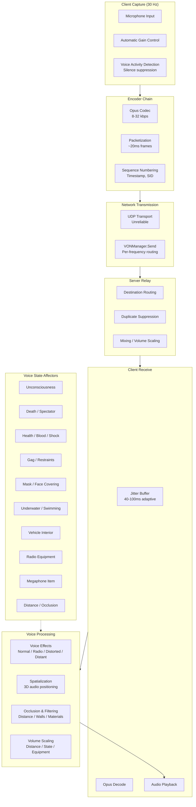
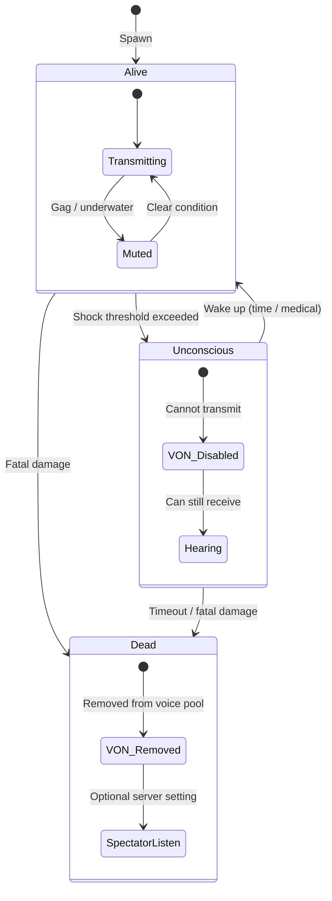

# Voice Communication (VON) Pipeline

Voice-over-Network (VON) handles real-time voice communication between players. It is implemented in `3_game/vonmanager.c` (~7,800 lines) and spans the full pipeline from microphone capture through network transmission to audio playback, with integration into player states, equipment, vehicles, and the sound occlusion system.

## Pipeline Architecture



### Pipeline Steps

| Step | Component | Frequency | Notes |
|------|-----------|-----------|-------|
| **1. Capture** | Microphone → AGC → VAD | 30 Hz update | Silence packets suppressed to save bandwidth |
| **2. Encode** | Opus codec (8–32 kbps) | Per-20ms frame | ~50 packets/second when talking |
| **3. Transmit** | UDP, unreliable | On voice activity | No retransmission — low latency priority |
| **4. Route** | Server relay | Packet received | Server fans out to relevant recipients |
| **5. Receive** | Jitter buffer → decode | Adaptive 40–100ms | Compensates for network jitter |
| **6. Process** | FX → spatialize → occlude → gain | Per-packet | Applies all state-based modifications |
| **7. Play** | Speaker output | Real-time | Mixed with game audio |

## VONManager API

The core voice system interface (`3_game/vonmanager.c`). `VONManager` is a thin static wrapper; the real work happens in `VONManagerBase`. Core functionality includes start/stop transmission, radio frequency tuning, and voice effect management.

### Voice Channels

| Channel | Base Range | Audio Quality | Spatial Audio | Frequency |
|---------|-----------|---------------|---------------|-----------|
| PROXIMITY | ~50m (configurable) | High (full Opus) | Yes (3D positioned) | N/A |
| RADIO | Unlimited (by frequency) | Reduced (8–16 kbps, band-limited) | No (mono, direct) | 87.5–108.0 MHz |
| MEGAPHONE | ~200m | Amplified, clipped | Yes (3D positioned) | N/A |

Voice channel routing is handled internally by `VONManagerBase`; there is no exposed `VoiceChannel` enum in script.

### Voice Effects

```c
enum VoiceEffectType {
    NORMAL,      // Clean, direct voice (proximity)
    RADIO,       // Band-limited, compression artifact simulation
    DISTORTED,   // Heavy distortion (damage, shock, improvised radio)
    DISTANT      // Low-passed, attenuated (far proximity edge, through walls)
};
```

## Player State Integration Seams

Voice state is tightly coupled with the player's physical and health state. The following table summarises how each state affects the VoIP pipeline:

| Player State | Affects | Mechanism | Effect |
|-------------|---------|-----------|--------|
| **Alive & Healthy** | — | Normal pipeline | Full-duplex, all channels available |
| **Unconscious** | ❌ Cannot transmit | `HumanCommandUnconscious` → voice disabled | Mic cut; can still hear others |
| **Dead** | ❌ Cannot transmit | Death state (`HumanCommandDeath`) → VON disconnected | Fully removed from voice pool; spectators hear nothing |
| **Spectator** | ❌ Cannot transmit | Spectator mode → no voice out | Can only listen if `voiceSpectatorListen` enabled |
| **Gagged** | ❌ Cannot transmit | Mouth obstruction → voice blocked | Nearby players hear muffled sounds (<5m); radio blocked |
| **Underwater** | 🔻 Heavily muffled | Submerged → voice effect → DISTANT + low-pass | ~90% volume reduction; only PROXIMITY (<2m) |
| **Swimming (surface)** | 🔻 Reduced | Head partially submerged | Voice effect DISTANT; range halved (~25m) |
| **Low Health / Bleeding** | 🔻 Weakened | Health < 3000 → volume reduced, distortion added | Voice transitions toward DISTORTED at critical health |
| **High Shock** | 🔻 Distorted | Shock > 5000 → audio distortion | Voice breaks up, pitch instability |
| **Broken Jaw*** | 🔻 Muffled | (Simulated via head hit) | Similar to gag; reduced intelligibility |
| **Fever / Illness** | 🔻 Weakened | Agents (influenza, cold) → voice scratchy | Subtle distortion, occasional cutouts (cough) |
| **Adrenaline (Epinephrine)** | 🔺 Temporarily boosted | Epinephrine modifier → voice projection +10–20% | Slightly louder, more forceful delivery |
*Broken jaw is not a discrete game mechanic but is approximated by head-zone damage effects.

### Unconsciousness



When a player enters `HumanCommandUnconscious`:

1. `VONManager.StopTransmitting()` is called immediately (cuts the mic)
2. `IsTransmitting()` returns `false`
3. The player is removed from the active speaker set on the server
4. The player **can still hear** other players' proximity and radio chat
5. Voice output volume is reduced by ~30% while unconscious (muffled perception)
6. On revival, the mic remains off until the player manually keys PTT again

### Death

When a player dies (`HumanCommandDeath`):

1. VON transmission is terminated immediately
2. The player is **removed from the voice routing table** on the server
3. Other players no longer receive the dead player's audio packets
4. The dead player transitions to spectator/death cam — voice out is disabled
5. By default, spectators hear **no voice at all**
6. Server config `voiceSpectatorListen` (boolean) can re-enable **listening only** for spectators

```c
// Server-side voice routing logic (pseudocode)
void OnPlayerVoicePacket(int sourcePlayerId, VoiceChannel channel, bytes data) {
    PlayerIdentity source = GetPlayerIdentity(sourcePlayerId);

    // --- State checks ---
    if (source.IsDead() || source.IsUnconscious()) {
        return;  // Drop packet — dead/uncon players cannot speak
    }

    // --- Route based on channel ---
    switch (channel) {
        case PROXIMITY:
            // Send to all alive players within range who pass occlusion
            ForEachPlayerInRange(source.GetPosition(), PROXIMITY_RANGE, player => {
                if (!player.IsDead() && !player.IsUnconscious()) {
                    float audibility = CalculateVoiceAudibility(source, player);
                    SendVoicePacket(player, channel, data, audibility);
                }
            });
            break;

        case RADIO:
            // Send to all alive players tuned to the same frequency
            ForEachPlayerOnFrequency(source.GetRadioFrequency(), player => {
                if (!player.IsDead() && !player.IsUnconscious()) {
                    SendVoicePacket(player, channel, data, 1.0);
                }
            });
            break;
    }
}
```

### Gag / Restraints

When a player is gagged (via `actiongagtarget.c` or `actiongagself.c`):

1. A `GagState` modifier is applied to the player
2. Voice transmission is **blocked for RADIO** and **severely attenuated for PROXIMITY**
3. Nearby players (<5m) hear muffled, unintelligible sounds at very low volume
4. The `VoiceEffectType` is forced to `DISTORTED`
5. The gag can be removed via `actionungagself.c` or `actionungagtarget.c`

```c
// Gag voice handling (pseudocode)
float GetVoiceOutputVolume(PlayerIdentity player, PlayerIdentity listener) {
    if (player.IsGagged()) {
        if (listener.GetDistance(player) > 5.0f) return 0.0f;  // Inaudible beyond 5m
        return 0.15f;  // Severely muffled
    }
    return CalculateNormalVolume(player, listener);
}
```

## Equipment Integration

### Radio Equipment

Defined in `DZ/gear/radio/`:

| Item | Range | Power Source | Frequency | Notes |
|------|-------|-------------|-----------|-------|
| `PersonalRadio` | 5 km | Battery9V | User-tunable | Handheld; consumes battery while transmitting |
| `BaseRadio` | Global (server) | Mains electricity | Fixed | World-spawned; cannot be carried |
| `ItemRadio` | Global | Battery9V | User-tunable | Full-size; higher battery drain |
| `ItemMegaphone` | 100 m (amplified) | Battery9V | N/A | Amplifies proximity voice; not frequency-based |

Radio behaviour:

- Voice over RADIO channel is **band-limited** (300 Hz – 3.4 kHz, simulating narrowband radio)
- Radio audio uses the `RADIO` `VoiceEffectType` — adds compression artifacts, slight noise floor
- Transmission range for `PersonalRadio` is 5 km; beyond this the signal fades to nothing
- `BaseRadio` and `Radio` have global range — all players on the same frequency hear regardless of distance
- Radios require a battery with charge > 0 to transmit; they can still **receive** without battery
- Tuning is done via `actiontunefrequency.c` / `actiontunefrequencyonground.c`

```cpp
// DZ/gear/radio/config.cpp (conceptual)
class PersonalRadio: Inventory_Base {
    range = 5000;              // 5 km max range
    frequencyMin = 87.5;
    frequencyMax = 108.0;
    powerSource = "Battery9V";
    powerConsumption = 0.05;   // Per second of transmission
};
```

### Megaphone

The megaphone uses the **PROXIMITY** channel but with boosted parameters:

- Range increased from ~50m to ~200m
- Voice effect set to `DISTORTED` (simulates speaker amplification clipping)
- Volume is boosted (1.5×–2.0× normal)
- Voice cone angle narrowed (~60° forward-facing cone)
- Requires `actionraisemegaphone.c` to activate
- Drains battery while active

### Vehicle Intercom / PA System

Vehicles can optionally integrate with the VON system for internal crew communication and external public address. This is configured per vehicle via the engine config tree (`cfgVehicles`), not through script-exposed booleans.

| Vehicle Feature | Channel | Range | Internal/External | Audio Quality |
|----------------|---------|-------|-------------------|---------------|
| Vehicle PA | MEGAPHONE | ~200m | External | Distorted, amplified |
| Vehicle Intercom | PROXIMITY (internal) | ~15m (vehicle interior) | Internal only | Normal, but with vehicle cabin EQ |

## Voice Occlusion & Spatial Audio

Proximity voice uses the same occlusion model as game audio:

```mermaid
flowchart LR
    subgraph Occlusion["Proximity Voice Occlusion"]
        DIST[Distance Falloff]
        OBST[Wall / Object Obstruction]
        MAT[Surface Material Absorption]
        WEATHER[Wind / Rain Noise]
        CONE[Voice Direction Cone]
    end

    subgraph Output["Per-Listener Volume"]
        RESULT[0.0 (silent) → 1.0 (full)]
    end

    DIST --> RESULT
    OBST --> RESULT
    MAT --> RESULT
    WEATHER --> RESULT
    CONE --> RESULT
```

### Factor Details

| Factor | Effect | Implementation |
|--------|--------|----------------|
| **Distance** | Volume drops from 100% at 0m to 0% at ~50m | Uses `characterAttenuationCurve` from `CfgSoundCurves` |
| **Obstructions** | Walls reduce volume by 50–90% depending on material | Raycast-based occlusion check from speaker's mouth to listener's ear |
| **Materials** | Concrete blocks more than wood; brick more than glass | `GetMaterialAbsorption()` per material type |
| **Weather** | Rain adds noise floor (SNR reduction); wind carries sound downwind | Wind vector × distance; rain intensity added to noise floor |
| **Voice Cone** | Forward-facing voice projects further; behind-speaker is quieter | `SetVoiceCone(angle, radius)` — ~120° forward cone, ~6dB rear attenuation |
| **Underwater** | Heavily muffled, ~90% volume reduction, extreme low-pass | Triggered when speaker or listener is submerged |
| **Vehicle Interior** | Cabin EQ applied (boosted lows, reduced highs, slight reverb) | Activated when in `Transport` with closed windows |

```c
// Voice audibility calculation (pseudocode)
float CalculateVoiceAudibility(PlayerIdentity speaker, PlayerIdentity listener) {
    float volume = 1.0;

    // 1. Distance falloff
    float dist = vector.Distance(speaker.GetPosition(), listener.GetPosition());
    volume *= GetRolloffFactor(dist, 0.0, PROXIMITY_RANGE);

    // 2. Occlusion from obstacles (engine-level raycast)
    float occlusion = GetOcclusionFactor(
        speaker.GetBonePosition("head"),    // Source: speaker's head
        listener.GetBonePosition("ear")      // Listener: ear position
    );
    volume *= (1.0 - occlusion);

    // 3. Material absorption
    string material = GetSurfaceMaterial(listener.GetPosition());
    volume *= GetMaterialAbsorptionFactor(material);

    // 4. Weather modifier
    volume *= GetWeatherVoiceModifier(windSpeed, rainIntensity);

    // 5. Voice cone (speaker orientation relative to listener)
    float coneAttenuation = GetVoiceConeAttenuation(speaker, listener);
    volume *= coneAttenuation;

    // 6. State-based modifiers
    if (listener.IsUnconscious()) volume *= 0.7;   // Muffled perception
    if (speaker.IsGagged()) volume *= 0.15;
    if (speaker.IsUnderwater()) volume *= 0.1;

    return Math.Clamp(volume, 0.0, 1.0);
}
```

## Voice Data Reliability & Bandwidth

| Property | Value |
|----------|-------|
| **Transport** | UDP (unreliable) |
| **Codec** | Opus (8–32 kbps variable) |
| **Frame size** | 20 ms |
| **Packet rate** | ~50 pps when actively speaking |
| **Bitrate (typical)** | ~16 kbps per active speaker |
| **Jitter buffer** | 40–100 ms (adaptive) |
| **VAD** | Silence suppression — no packets sent when quiet |
| **AGC** | Automatic gain control — normalises input level |

### Bandwidth Impact

| Scenario | Per-Active-Speaker | Notes |
|----------|-------------------|-------|
| **2 players talking** | ~32 kbps each | Squad communication |
| **4 players talking** | ~16 kbps each | Opus adjusts bitrate downward |
| **10 players talking** | ~8 kbps each | Minimal quality, prioritises delivery |
| **PTT quiet (no voice)** | 0 kbps | Silence suppressed |

Voice data is the **only** game traffic sent over pure UDP (unreliable). All other game network traffic uses reliable delivery (TCP-like) or sequenced unreliable delivery. This ensures voice latency stays low — dropped voice packets are simply skipped, not retransmitted.

## Config Data & Sound Pipeline

Voice sounds (pain, death, breath, etc.) go through the standard sound pipeline documented in [Sound Hierarchy](/data-config/sound-hierarchy):

```
Voice WAV/OGG files
    ↓
CfgSoundShaders (e.g., Char_Voice_Pain_SoundShader)
    ↓ range = 35
CfgSoundSets (e.g., Char_Voice_Pain_SoundSet)
    ↓ volumeCurve = characterAttenuationCurve
CfgSound3DProcessors (character3DProcessingType)
    ↓ spatial = 1
Script references (SoundEvents, VON playback)
```

### Voice Sound File Directories

```
DZ/sounds/Characters/
├── voice/          — Player vocalisations (pain, death, breath)
│   ├── pain/       — Grunts, yelps on hit
│   ├── death/      — Death sounds
│   ├── breath/     — Breathing, exertion
│   └── sick/       — Coughing, sneezing (disease symptoms)
├── attacks/        — Melee attack vocalisations
├── injuries/       — Injury reaction sounds
├── unconscious/    — Sounds played while unconscious (breathing)
└── movement/       — Effort sounds during climbing, jumping
```

## Modding Integration Points

| Hook / Override | Location | Purpose |
|-----------------|----------|---------|
| `VONManager` class | `3_game/vonmanager.c` | Override voice behaviour |
| `VONManagerBase` class | `3_game/vonmanager.c` | Core VON logic |
| `CfgSoundShaders` / `CfgSoundSets` | `DZ/sounds/hpp/` | Custom voice sound definitions |
| Radio items | `DZ/gear/radio/` | Custom radio equipment |
| Vehicle intercom/PA | Vehicle config | Per-vehicle voice features |
| Server config `voiceSpectatorListen` | Server config | Toggle spectator voice |

### Common Mod Scenarios

| Scenario | Approach |
|----------|----------|
| **Add a new radio item** | Extend `TransmitterBase` in `DZ/gear/radio/` config |
| **Modify proximity range** | Override in `VONManagerBase` |
| **Add vehicle intercom to a mod vehicle** | Configure via engine `cfgVehicles` tree |
| **Per-player voice muting (admin)** | Call transmission control from admin tools |
| **Death voice / last words** | Trigger a one-shot voice packet on `HumanCommandDeath` before VON disconnect |

## Related Systems

- **Sound System**: Audio playback, sound configs, occlusion model — see [Sound System](./sound-system)
- **Networking & RPC**: UDP transport for voice, player identity, replication — see [Networking & RPC](./networking)
- **Player System**: Player states (unconscious, death) that gate voice — see [Player System](./player-system)
- **Damage & Combat**: Shock, bleeding, health thresholds that modify voice quality — see [Damage & Combat](./damage-combat)
- **Effect System**: Visual effects that accompany voice states (blood loss, unconsciousness) — see [Effect System](./effect-system)
- **Vehicle System**: Vehicle intercom and PA integration — see [Vehicle System](./vehicle-system)
- **Player Stats**: Health, blood, shock levels affecting voice quality — see [Player Stats](/world-gameplay/player-stats)
- **Player Modifiers**: Gag state, unconsciousness modifier — see [Layer 4: World](/script-layers/4-world)
- **Sound Hierarchy**: Config pipeline for voice sound shaders and sets — see [Sound Hierarchy](/data-config/sound-hierarchy)
- **Gear Items**: Radio equipment definitions — see [Gear & Items](/data-config/gear-items)
