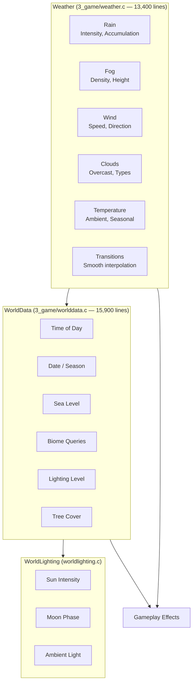
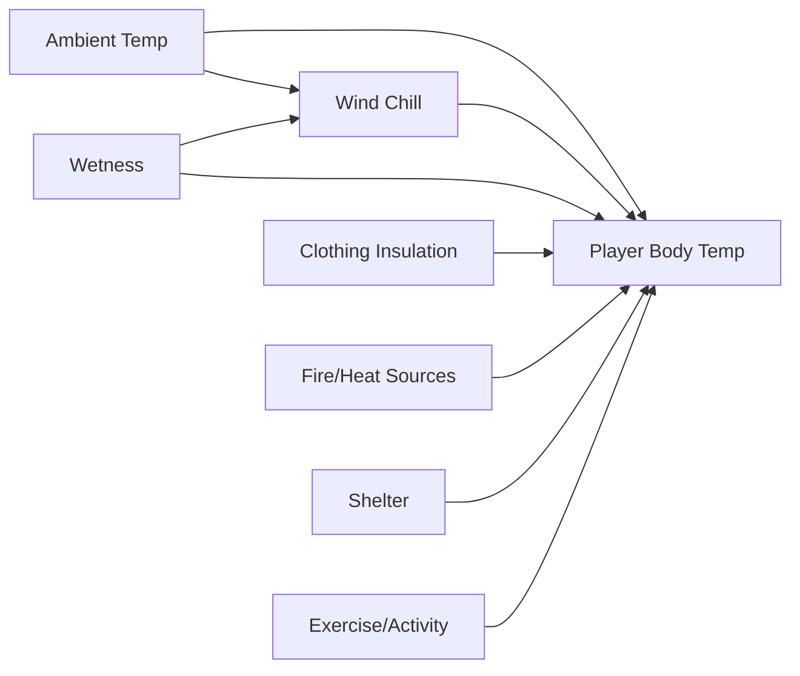

# Weather & Environment System

The weather system manages atmospheric conditions that affect gameplay, visibility, sound propagation, and player status. It is one of the largest systems, with `Weather` at ~13,400 lines and `WorldData` at ~15,900 lines.

## Architecture



## Weather Components

### Rain

Rain is the most gameplay-impactful weather component, affecting multiple systems:

| Effect | Description |
|--------|-------------|
| **Visibility** | Reduces viewing distance proportional to intensity |
| **Sound masking** | Rain noise covers other sounds, reducing detection range |
| **Player wetness** | Causes wetness accumulation, accelerates heat loss |
| **Footstep audio** | Footstep sounds change to wet-surface variants |
| **Water collection** | Rain fills containers placed outside (rain barrels, pots) |

```c
class Weather {
    float GetRainIntensity();       // 0.0 — 1.0
    float GetRainAccumulation();    // Accumulated rain amount (mm)
    bool IsRaining();
};
```

### Fog

Fog creates atmosphere and drastically alters gameplay:

| Effect | Description |
|--------|-------------|
| **Visibility** | Severely limits sight distance; dense fog reduces to ~50m |
| **Tension** | Creates stealth gameplay opportunities |
| **Thermal** | Affects temperature modeling (fog insulates) |

```c
class Weather {
    float GetFogDensity();          // 0.0 — 1.0
    float GetFogHeight();           // Fog ceiling height in meters
};
```

### Wind

Wind is a multi-dimensional parameter affecting several systems:

| Effect | Description |
|--------|-------------|
| **Sound propagation** | Wind direction affects how sound travels; upwind sound carries further |
| **Visual** | Tree/grass movement animation driven by wind vector |
| **Wind chill** | Reduces player temperature based on wind speed × temperature offset |
| **Particle direction** | Smoke, dust, rain particles move with wind direction |

```c
class Weather {
    float GetWindSpeed();           // Wind speed in m/s
    vector GetWindDirection();      // Wind direction vector
};
```

### Cloud Cover

Clouds act as a thermal regulator and visual indicator:

| Effect | Description |
|--------|-------------|
| **Temperature** | Heavy clouds insulate, preventing rapid temperature drops at night |
| **Lighting** | Overcast reduces ambient light levels during day |
| **Rain probability** | Heavy cloud cover precedes rain events |
| **Night visibility** | Clear nights are darker; overcast nights retain some ground heat |

```c
class Weather {
    float GetOvercast();            // 0.0 (clear) — 1.0 (full overcast)
};
```

## Temperature System

Player temperature is affected by multiple interacting environmental factors:

```c
const float PLAYER_TEMPERATURE_HOT = 42.0;
const float PLAYER_TEMPERATURE_NORMAL = 36.5;
const float PLAYER_TEMPERATURE_COLD = 35.0;
const float PLAYER_TEMPERATURE_FREEZING = 30.0;
```

### Factors Affecting Body Temperature



| Factor | Effect | Source |
|--------|--------|--------|
| **Ambient temperature** | Baseline from world data | `Weather.GetTemperature()` |
| **Wind chill** | Multiplier based on wind speed × (ambient - body temp) | `Weather.GetWindSpeed()` |
| **Wetness** | Accelerates heat loss proportional to wetness level | Player modifier |
| **Clothing insulation** | Reduces heat loss; each item has insulation value | DZ config per item |
| **Fire/heat sources** | Positive heat input near campfires, heat packs | Proximity check |
| **Shelter** | Buildings block wind/precipitation | Interior detection |
| **Exercise** | Running generates body heat; shivering generates minor heat | Player activity |

## World Data (`worlddata.c`, ~15,900 lines)

The `WorldData` class manages the world simulation state:

```c
class WorldData {
    // Time management
    float GetTimeOfDay();           // Current time (0.0 — 24.0)
    float GetDate();                // Current date
    
    // World queries
    float GetSeaLevel();            // Sea level for water simulation
    bool IsNight();                 // Check if night time
    float GetLighting();            // Current lighting level (0.0 — 1.0)
    
    // Biome queries
    int GetBiome(vector position);  // Get biome at position
    float GetTreeCover(vector pos); // Tree cover density (0.0 — 1.0)
};
```

### Biome System

The biome system determines environmental properties per location:

| Biome | Characteristics |
|-------|----------------|
| **Forest** | Tree cover, reduced wind, darker, cooler, animal spawns |
| **Field/Meadow** | Open, full wind exposure, warmer in sun, animal grazing |
| **Coastal** | Sea level proximity, wind from water, fog banks |
| **Urban** | Buildings provide shelter, reduced tree cover, artificial light |
| **Mountain** | Lower temperature, higher wind, reduced tree cover |
| **Swamp/Marsh** | High wetness, fog, insect ambience |

Biomes affect gameplay through:
- Ambient temperature offset
- Wind exposure multiplier
- Tree cover affecting visibility and audio
- Animal/AI spawn probabilities
- Ground surface types for footstep audio

## Weather Transitions

Weather changes smoothly over time with configurable transition durations:

```c
class Weather {
    void SetRainIntensity(float target, float transitionTime);
    void SetFogDensity(float target, float transitionTime);
    void SetOvercast(float target, float transitionTime);
    void SetWindParams(float speed, vector direction, float transitionTime);
};
```

Transitions are typically triggered by:
- **Overworld weather patterns**: Large-scale simulated weather systems moving across the map
- **Time of day**: Fog often forms at dawn/morning; temperature drops at night
- **Region**: Different biomes have different base weather patterns
- **Script events**: Mission-triggered weather changes (dynamic events, contamination zones)
- **Season**: Date-based seasonal variation affects temperature ranges and precipitation probability

## Effects on Gameplay

| Condition | Gameplay Effect |
|-----------|-----------------|
| Rain | Masks footsteps, reduces visibility, causes wetness → cold |
| Fog | Severely limits sight range, creates stealth opportunities |
| Night | Dramatically reduces visibility, requires light sources, affects AI detection |
| Cold | Shivering affects aim, requires warm clothing, increases calorie consumption |
| Heat | Causes sweating/drying, increases water consumption, heatstroke risk |
| Wind | Affects sound propagation directionally, wind chill factor, particle movement |
| Overcast | Reduces solar heating, prevents rapid nighttime temperature drops |
| Clear | Maximum visibility, highest temperature variation (hot day / cold night) |

## Integration with Other Systems

- **Player system**: Temperature affects player vital stats; shivering degrades aiming — see [Player System](./player-system)
- **Sound system**: Weather affects sound propagation (wind direction, rain masking) — see [Sound System](./sound-system)
- **Effect system**: Rain/snow particle effects, fog visual layers, breath vapor — see [Effect System](./effect-system)
- **AI system**: Weather affects AI detection ranges (fog reduces sight, rain masks hearing) — see [AI System](./ai-system)
- **Animation system**: Player shivering animation, rain-sheltering poses — see [Animation System](./animation-system)
- **PP effects**: Post-processing effects for rain on lens, fog color grading, overcast desaturation
- **World Lighting**: Sun/moon position determines ambient light — see `WorldLighting`
