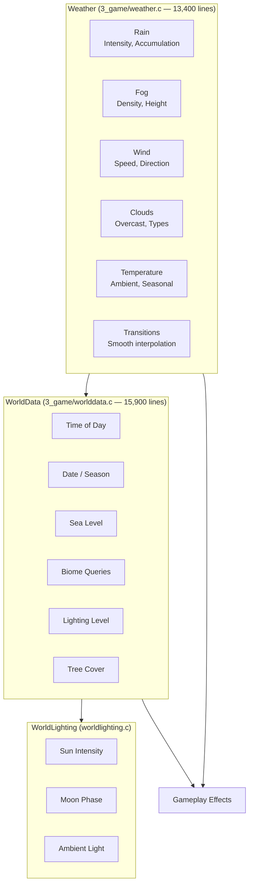
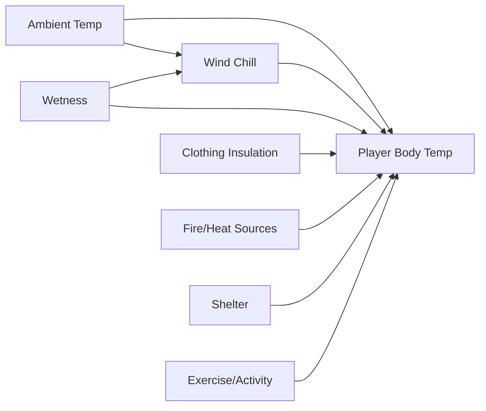

# Weather & Environment System

The weather system manages atmospheric conditions that affect gameplay, visibility, sound propagation, and player status. It is one of the largest systems, with `Weather` at ~13,400 lines and `WorldData` at ~15,900 lines.

## Architecture



## Weather Components

### Rain

Rain is the most gameplay-impactful weather component, affecting multiple systems:

| Effect | Description |
|--------|-------------|
| **Visibility** | Reduces viewing distance proportional to intensity |
| **Sound masking** | Rain noise covers other sounds, reducing detection range |
| **Player wetness** | Causes wetness accumulation, accelerates heat loss |
| **Footstep audio** | Footstep sounds change to wet-surface variants |
| **Water collection** | Rain fills containers placed outside (rain barrels, pots) |

```c
// Weather provides Rain as an object (NOT float intensity)
class Weather {
    proto native Rain GetRain();        // Returns Rain object
    // Rain state is read through the Rain object,
    // NOT via GetRainIntensity() / GetRainAccumulation() / IsRaining()
};
```

### Fog

Fog creates atmosphere and drastically alters gameplay:

| Effect | Description |
|--------|-------------|
| **Visibility** | Severely limits sight distance; dense fog reduces to ~50m |
| **Tension** | Creates stealth gameplay opportunities |
| **Thermal** | Affects temperature modeling (fog insulates) |

```c
class Weather {
    proto native Fog GetFog();          // Returns Fog object
    // Fog state is read through the Fog object,
    // NOT via GetFogDensity() / GetFogHeight()
};
```

### Wind

Wind is a multi-dimensional parameter affecting several systems:

| Effect | Description |
|--------|-------------|
| **Sound propagation** | Wind direction affects how sound travels; upwind sound carries further |
| **Visual** | Tree/grass movement animation driven by wind vector |
| **Wind chill** | Reduces player temperature based on wind speed × temperature offset |
| **Particle direction** | Smoke, dust, rain particles move with wind direction |

```c
class Weather {
    proto native float GetWindSpeed();              // Wind speed in m/s
    proto native vector GetWind();                  // Wind as vector
    proto native WindDirection GetWindDirection();  // Returns WindDirection (angle radians)
    proto native WindMagnitude GetWindMagnitude();  // Returns WindMagnitude object
};
```

### Cloud Cover

Clouds act as a thermal regulator and visual indicator:

| Effect | Description |
|--------|-------------|
| **Temperature** | Heavy clouds insulate, preventing rapid temperature drops at night |
| **Lighting** | Overcast reduces ambient light levels during day |
| **Rain probability** | Heavy cloud cover precedes rain events |
| **Night visibility** | Clear nights are darker; overcast nights retain some ground heat |

```c
class Weather {
    proto native Overcast GetOvercast();  // Returns Overcast object (NOT float)
};
```

## Temperature System

Player temperature is affected by multiple interacting environmental factors:

```c
// From PlayerConstants — verified values
class PlayerConstants {
    static const float NORMAL_TEMPERATURE_L = 36.0;
    static const float NORMAL_TEMPERATURE_H = 36.5;
    static const float HIGH_TEMPERATURE_L = 38.5;
    static const float HIGH_TEMPERATURE_H = 39.0;
};
```

> **Correction:** The previous version used fabricated names (`PLAYER_TEMPERATURE_HOT = 42.0`, `PLAYER_TEMPERATURE_COLD = 35.0`, `PLAYER_TEMPERATURE_FREEZING = 30.0`). The real constants use `NORMAL_TEMPERATURE_*` and `HIGH_TEMPERATURE_*` prefixes.

### Factors Affecting Body Temperature



| Factor | Effect | Source |
|--------|--------|--------|
| **Ambient temperature** | Baseline from world data | `WorldData.GetTemperature()` |
| **Wind chill** | Multiplier based on wind speed × (ambient - body temp) | `Weather.GetWindSpeed()` |
| **Wetness** | Accelerates heat loss proportional to wetness level | Player modifier |
| **Clothing insulation** | Reduces heat loss; each item has insulation value | DZ config per item |
| **Fire/heat sources** | Positive heat input near campfires, heat packs | Proximity check |
| **Shelter** | Buildings block wind/precipitation | Interior detection |
| **Exercise** | Running generates body heat; shivering generates minor heat | Player activity |

## World Data (`worlddata.c`, ~15,900 lines)

The `WorldData` class manages the world simulation state. **Verified methods:**

```c
class WorldData {
    // Time
    int GetDaytime();                          // Current daytime value
    float GetApproxSunriseTime(float monthday); // Approximate sunrise
    float GetApproxSunsetTime(float monthday);  // Approximate sunset

    // Temperature
    float GetBaseEnvTemperature();             // Base environment temperature
    float GetBaseEnvTemperatureAtObject(notnull Object object);
    float GetBaseEnvTemperatureAtPosition(vector pos);
    float GetBaseEnvTemperatureExact(int month, int day, int hour, int minute);
    float GetTemperature(Object object,
        EEnvironmentTemperatureComponent properties = EEnvironmentTemperatureComponent.BASE);

    // Weather integration
    void UpdateWeatherEffects(Weather weather, float timeslice);
    float ComputeSnowflakeScale(Weather weather);
    bool WeatherOnBeforeChange(EWeatherPhenomenon type, float actual,
        float change, float time);

    // Environment
    int GetPollution();
    float GetWindCoef();
    float GetDayTemperature();
    float GetNightTemperature();
    float GetAgentSpawnChance(eAgents agent);

    // ... (73 total members)
};
```

> **Correction:** There are NO `GetTimeOfDay()`, `GetDate()`, `GetSeaLevel()`, `IsNight()`, `GetLighting()`, `GetBiome()`, or `GetTreeCover()` methods on `WorldData`. These were all fabricated in the previous version. Date/time is accessed via `GetGame().GetWorld().GetDate(...)` (engine API).

### Biome System

> **[speculative]** The biome system and its properties have not been independently verified against source. `WorldData` has NO `GetBiome()` or `GetTreeCover()` methods. The following is retained from the original page as a gameplay observation only:

| Biome | Characteristics |
|-------|----------------|
| **Forest** | Tree cover, reduced wind, darker, cooler, animal spawns |
| **Field/Meadow** | Open, full wind exposure, warmer in sun, animal grazing |
| **Coastal** | Sea level proximity, wind from water, fog banks |
| **Urban** | Buildings provide shelter, reduced tree cover, artificial light |
| **Mountain** | Lower temperature, higher wind, reduced tree cover |
| **Swamp/Marsh** | High wetness, fog, insect ambience |

Biomes affect gameplay through:
- Ambient temperature offset
- Wind exposure multiplier
- Tree cover affecting visibility and audio
- Animal/AI spawn probabilities
- Ground surface types for footstep audio

## Weather Control

Weather can be modified at runtime via `Weather` methods. **Verified setters:**

```c
class Weather {
    proto native void SetStorm(float density, float threshold, float timeOut);
    proto native void SetWind(vector wind);
    proto native void SetWindSpeed(float speed);
    proto native void SetWindMaximumSpeed(float maxSpeed);
    proto native void SetWindFunctionParams(float fnMin, float fnMax, float fnSpeed);
    proto native void SetRainThresholds(float tMin, float tMax, float tTime);
    proto native void SetSnowfallThresholds(float tMin, float tMax, float tTime);
    proto native void SetSnowflakeScale(float scale);
    proto native void SetDynVolFogDistanceDensity(float value, float time = 0);
    proto native void SetDynVolFogHeightDensity(float value, float time = 0);
    proto native void SetDynVolFogHeightBias(float value, float time = 0);
    proto native void SuppressLightningSimulation(bool state);
};
```

> **Correction:** There are NO `SetRainIntensity()`, `SetFogDensity()`, `SetOvercast()`, or `SetWindParams()` methods. These were fabricated in the previous version. Weather transitions are controlled through threshold-based methods and dynamic volumetric fog parameters.

## Effects on Gameplay

| Condition | Gameplay Effect |
|-----------|-----------------|
| Rain | Masks footsteps, reduces visibility, causes wetness → cold |
| Fog | Severely limits sight range, creates stealth opportunities |
| Night | Dramatically reduces visibility, requires light sources, affects AI detection |
| Cold | Shivering affects aim, requires warm clothing, increases calorie consumption |
| Heat | Causes sweating/drying, increases water consumption, heatstroke risk |
| Wind | Affects sound propagation directionally, wind chill factor, particle movement |
| Overcast | Reduces solar heating, prevents rapid nighttime temperature drops |
| Clear | Maximum visibility, highest temperature variation (hot day / cold night) |

## Integration with Other Systems

- **Player system**: Temperature affects player vital stats; shivering degrades aiming — see [Player System](./player-system)
- **Sound system**: Weather affects sound propagation (wind direction, rain masking) — see [Sound System](./sound-system)
- **Effect system**: Rain/snow particle effects, fog visual layers, breath vapor — see [Effect System](./effect-system)
- **AI system**: Weather affects AI detection ranges (fog reduces sight, rain masks hearing) — see [AI System](./ai-system)
- **Animation system**: Player shivering animation, rain-sheltering poses — see [Animation System](./animation-system)
- **PP effects**: Post-processing effects for rain on lens, fog color grading, overcast desaturation
- **World Lighting**: Sun/moon position determines ambient light — see `WorldLighting`
